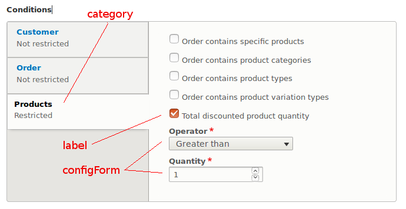

Conditions are a set of plugins unique to the commerce project. They are used
 to determine applicable Promotions, Payment Gateways, or Shipping Methods for an order.

In this context, conditions are not connected in function or code to conditions in 
core such as: Drupal\Core\Database\Query\Condition. 


Example user stories / use cases:
---
  - **Promotion:** As a store manager I want to encourage bulk ordering by 
  creating a promotion that applies to orders of at least 5 of the selected product. 
    - See it in action: [OrderItemQuantity - Total discounted product quantity](https://cgit.drupalcode.org/commerce/tree/modules/promotion/src/Plugin/Commerce/Condition/OrderItemQuantity.php)
    
    // TODO Creation instructions may be unnecessary. 
    - [How To Create a Promotion Condition](https://docs.drupalcommerce.org/commerce2/developer-guide/promotions/create-a-condition)
  
  - **Payment Gateway:** As a store manager I will only accept credit card 
  payments from customers with US billing addresses. [OrderBillingAddress - Billing address](https://cgit.drupalcode.org/commerce/tree/modules/order/src/Plugin/Commerce/Condition/OrderBillingAddress.php)
  
  - **Shipping:** As a store manager I want to offer flat rate shipping for 
  only certain products. [OrderProduct - Order contains specific products](https://cgit.drupalcode.org/commerce/tree/modules/product/src/Plugin/Commerce/Condition/OrderProduct.php)
  

Minimum requirements to build a condition:
---

As you can see from comparing [ConditionInterface](https://cgit.drupalcode.org/commerce/tree/src/Plugin/Commerce/Condition/ConditionInterface.php)
 with [ConditionBase](https://cgit.drupalcode.org/commerce/tree/src/Plugin/Commerce/Condition/ConditionBase.php)
, there is only one function required when extending ConditionBase to fulfill 
the ConditionInterface prescription: evaluate. 

```php
<?php
interface ConditionInterface extends ConfigurablePluginInterface, PluginFormInterface, PluginInspectionInterface {
  /** * Gets the condition label. */ 
  public function getLabel();
  /** * Shown in the condition UI when enabling/disabling a condition. */
  public function getDisplayLabel();
  /** * This is the entity type ID of the entity passed to evaluate(). */
  public function getEntityTypeId();

  /**
   * Evaluates the condition.
   *
   * @param \Drupal\Core\Entity\EntityInterface $entity
   *   The entity.
   *
   * @return bool
   *   TRUE if the condition has been met, FALSE otherwise.
   */
  public function evaluate(EntityInterface $entity);
}

```

Functionally, a condition would not be useful without some sort of user 
configuration. 'defaultConfiguration', 'buildConfigurationForm', and 
'validateConfigurationForm' go hand in hand with evaluate to create a basic 
condition.

Lets see how these functions are used in practice by analysing one of 
the simplest conditions to ship with commerce: OrderItemQuantity.


Annotations
---
```php
<?php
/**
 * Provides the total discounted product quantity condition.
 *
 * Implemented as an order condition to be able to count products across
 * non-combined order items.
 *
 * @CommerceCondition(
 *   id = "order_item_quantity",
 *   label = @Translation("Total discounted product quantity"),
 *   category = @Translation("Products"),
 *   entity_type = "commerce_order",
 *   parent_entity_type = "commerce_promotion",
 *   weight = 10,
 * )
 */
class OrderItemQuantity extends ConditionBase implements ParentEntityAwareInterface { }
```

'@CommerceCondition' calls Drupal\commerce\Annotation\CommerceCondition

  - 'id' - A machine name unique to commerce_order.
  - 'label' - This is displayed along with a checkbox to engage condition.
  - 'category' - Decides which container the condition label is displayed in.
  - 'entity_type' - Ensures that this promotion only applies to commerce orders. 
  Enforced by `$this->assertEntity($entity)` in the evaluate function.
  - 'parent_entity_type' - See next heading.
  - 'weight' - The order in which conditions are displayed within a container.





ParentEntityAwareTrait
---
The ParentEntityAware annotation, interface, and trait are optional for a 
condition. OrderItemQuantity uses these to specify that this condition is 
only available for a promotion, not a payment gateway or shipping method. 

This is explained concisely in the 
[\Drupal\commerce\Annotation CommerceCondition class](https://cgit.drupalcode.org/commerce/tree/src/Annotation/CommerceCondition.php).
```php
<?php
class CommerceCondition extends Plugin {
// ... 
/**
 * The parent entity type ID.
 *
 * This is the entity type ID of the entity that embeds the conditions.
 * For example: 'commerce_promotion'.
 *
 * When specified, a condition will only be available on that entity type.
 *
 * @var string
 */
public $parent_entity_type;
}
```

Configuration Form
---


Evaluate Function
---


Example using class OrderItemQuantity:

User story:
  As a store manager I want to encourage bulk ordering by creating a promotion that applies to orders of at least 5 of the selected product. 
  
 

```php
<?php
/**
 * Provides the total discounted product quantity condition.
 *
 * Implemented as an order condition to be able to count products across
 * non-combined order items.
 *
 * @CommerceCondition(
 *   id = "order_item_quantity",
 *   label = @Translation("Total discounted product quantity"),
 *   category = @Translation("Products"),
 *   entity_type = "commerce_order",
 *   parent_entity_type = "commerce_promotion",
 *   weight = 10,
 * )
 */
class OrderItemQuantity extends ConditionBase implements ParentEntityAwareInterface {

  use ParentEntityAwareTrait;

  /**
   * {@inheritdoc}
   */
  public function defaultConfiguration() {
    return [
      'operator' => '>',
      'quantity' => 1,
    ] + parent::defaultConfiguration();
  }

  /**
   * {@inheritdoc}
   */
  public function buildConfigurationForm(array $form, FormStateInterface $form_state) {
    $form = parent::buildConfigurationForm($form, $form_state);

    $form['operator'] = [
      '#type' => 'select',
      '#title' => t('Operator'),
      '#options' => $this->getComparisonOperators(),
      '#default_value' => $this->configuration['operator'],
      '#required' => TRUE,
    ];
    $form['quantity'] = [
      '#type' => 'number',
      '#title' => t('Quantity'),
      '#default_value' => $this->configuration['quantity'],
      '#min' => 1,
      '#required' => TRUE,
    ];

    return $form;
  }

  /**
   * {@inheritdoc}
   */
  public function submitConfigurationForm(array &$form, FormStateInterface $form_state) {
    parent::submitConfigurationForm($form, $form_state);

    $values = $form_state->getValue($form['#parents']);
    $this->configuration['operator'] = $values['operator'];
    $this->configuration['quantity'] = $values['quantity'];
  }

  /**
   * {@inheritdoc}
   */
  public function evaluate(EntityInterface $entity) {
    $this->assertEntity($entity);
    /** @var \Drupal\commerce_order\Entity\OrderInterface $order */
    $order = $entity;
    /** @var \Drupal\commerce_promotion\Entity\PromotionInterface $promotion */
    $promotion = $this->parentEntity;
    $offer = $promotion->getOffer();

    $quantity = '0';
    foreach ($order->getItems() as $order_item) {
      // If the offer has conditions, skip order items that don't match.
      if ($offer instanceof OrderItemPromotionOfferInterface) {
        $conditions = $offer->getConditions();
        $condition_group = new ConditionGroup($conditions, 'OR');
        if (!$condition_group->evaluate($order_item)) {
          continue;
        }
      }
      $quantity = Calculator::add($quantity, $order_item->getQuantity());
    }

    switch ($this->configuration['operator']) {
      case '>=':
        return $quantity >= $this->configuration['quantity'];

      case '>':
        return $quantity > $this->configuration['quantity'];

      case '<=':
        return $quantity <= $this->configuration['quantity'];

      case '<':
        return $quantity < $this->configuration['quantity'];

      case '==':
        return $quantity == $this->configuration['quantity'];

      default:
        throw new \InvalidArgumentException("Invalid operator {$this->configuration['operator']}");
    }
  }

}
```
[OrderItemQuantity.php](https://cgit.drupalcode.org/commerce/tree/modules/promotion/src/Plugin/Commerce/Condition/OrderItemQuantity.php)


! We need help filling out this section! Feel free to follow the *edit this page* link and contribute.

How to write  condition plugin.
