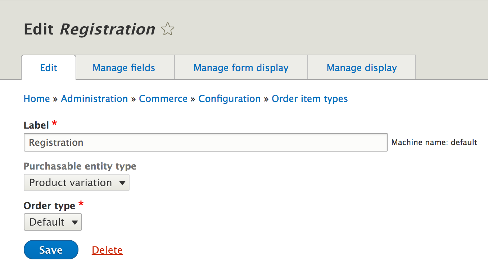

When it comes to product architectures, there is no one true answer.
Furthermore, different clients might have different needs. That’s why
it’s important for Commerce 2.x to support any number of product
architectures.

The ProductVariation entity class implements the PurchasableEntityInterface:

commerce/src/PurchasableEntityInterface.php

```php
      <?php
      
      namespace Drupal\commerce;
      
      use Drupal\Core\Entity\ContentEntityInterface;
      
      /**
       * Defines the interface for purchasable entities.
       *
       * Lives in Drupal\commerce instead of Drupal\commerce_order so that entity
       * type providing modules such as commerce_product don't need to depend
       * on commerce_order.
       */
      interface PurchasableEntityInterface extends ContentEntityInterface {
      
        /**
         * Gets the stores through which the purchasable entity is sold.
         *
         * @return \Drupal\commerce_store\Entity\StoreInterface[]
         *   The stores.
         */
        public function getStores();
      
        /**
         * Gets the purchasable entity's order item type ID.
         *
         * Used for finding/creating the appropriate order item when purchasing a
         * product (adding it to an order).
         *
         * @return string
         *   The order item type ID.
         */
        public function getOrderItemTypeId();
      
        /**
         * Gets the purchasable entity's order item title.
         *
         * Saved in the $order_item->title field to protect the order items of
         * completed orders against changes in the referenced purchased entity.
         *
         * @return string
         *   The order item title.
         */
        public function getOrderItemTitle();
      
        /**
         * Gets the purchasable entity's price.
         *
         * @return \Drupal\commerce_price\Price|null
         *   The price, or NULL.
         */
        public function getPrice();
      
      }
```

Any content entity type that implements this interface can be purchased.
The order module doesn’t depend on the product module, the product
module just provides the default (and most common) product architecture.
A product bundle module will probably want to define its own product
architecture, etc.

Line items have a purchased_entity reference field. The target\_type of
that reference field is different for each line item type.



Here the line item type points to the product variation entity type,
indicating that the "Product variation" line item type is used to
purchase product variations.

Early in the Commerce 2.x cycle we explored the idea of hierarchical
products, but after initial exploration found out that the idea required
several months of extra effort (having to rewrite the Tree module,
reinvent an IEF like widget, UX and performance considerations). We
removed it from the roadmap with a heavy heart, but now that Commerce
2.x supports custom product architectures, we can easily explore the
idea in contrib at a later date.

