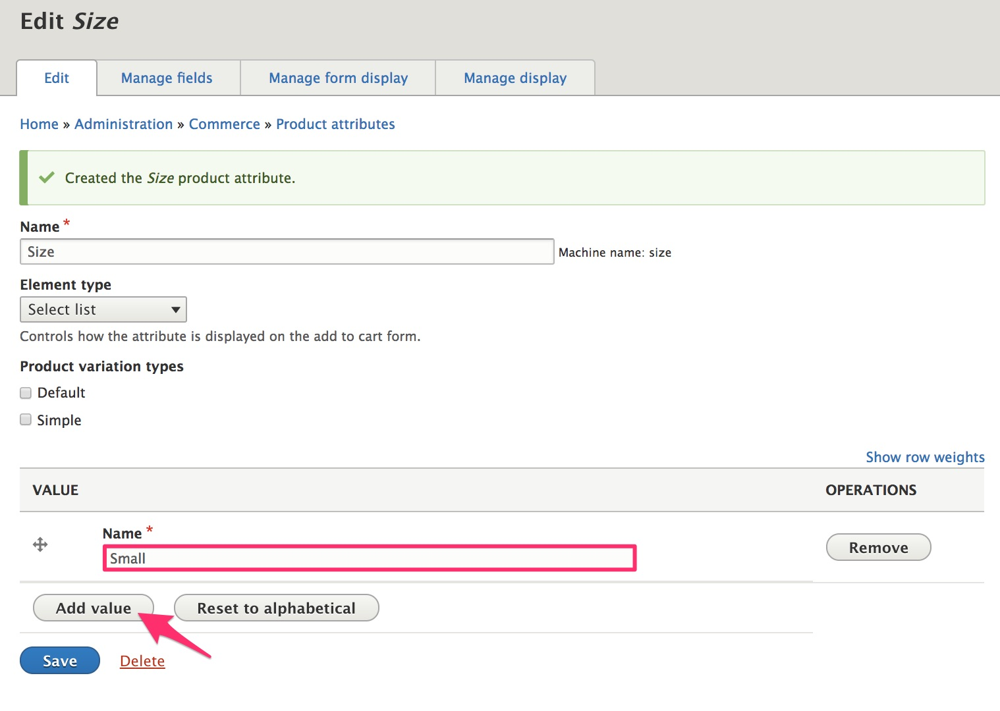
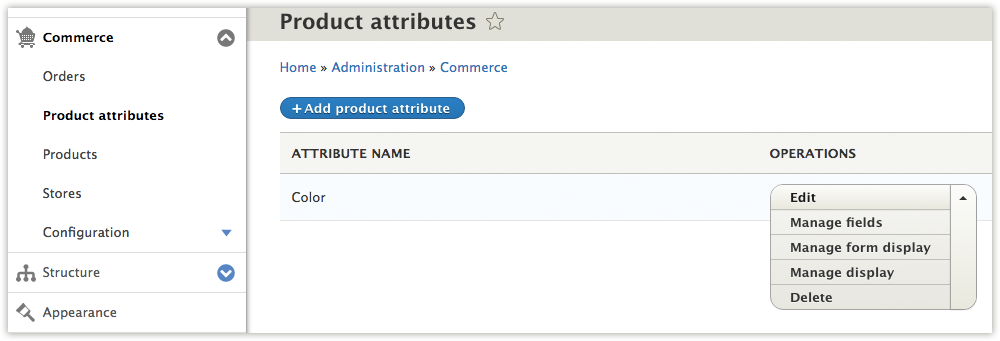

If your products have options like size, color, format, or package size, then you need to create product attributes and their values. For example, suppose you are selling a t-shirt that comes in a variety of sizes and colors. Then you need to create a "Size" attribute (with values like, "Small", "Medium", and "Large"), and you need to create a "Color" attribute (with values like "Red", "Blue", "Orange", and "Green").

As the above image suggests, a product with a particular set of attributes will not necessarily have a variation for every possible combination. Perhaps the size Large t-shirt is only available in Green, and the Medium t-shirt is only available in Blue and Orange.

### Create a simple product attribute

Let's start by creating a "Size" attribute with values Small, Medium, and Large.

1. Navigate to the "Product attributes" page by using the menu item under the main "Commerce" menu or `/admin/commerce/product-attributes`.
2. Enter "Size" for the Name.
3. Select "Select list" for the Element type. See [Product attributes] in the "Displaying products" documentation section for a description of how these options affect product displays.
4. Do not select any Product variation types. This Size attribute will not be used for the Default or Simple product types. When we create a new "Clothing" product type (below), we can come back to update the configuration.
5. Click the "Save" button to create the new product attributes.

#### Create product attribute values
On the Size product attribute configuration form, add "Small", "Medium", and "Large" as values.

1. Enter "Small" for the Name.
2. Click the "Add value" button. A new text field will appear in the list.
3. Enter "Medium".
4. Repeat steps 2 and 3 to enter "Large" as the third value.
5. Click the "Save" button.

You can use the drag-and-drop handle in the leftmost column, the "Reset to alphabetical" button, or the "Show row weights" link and "Weight" select lists to reorder the values. This order will be used on the form used to enter product variation data. CHECK ON THIS--FOR DEMO, ORDER DOESN'T SEEM TO WORK???

### Add a product attribute to a product variation type
In the [Simple product type](../01.simple-product) documentation, we created a product type named, "Simple". Use the same procedure to create a new product type named, "Clothing", including the addition of an "Images" field. Since the "Images" field serves the same purpose for both product variation types, you can Re-use the existing field instead of creating a new one:

If you look at the configuration form for any product variation type, you'll see that a new "Attributes" section has been added, with a checkbox for the new "Size" product attribute. Select this attribute for the "Clothing" product variation type: `/admin/commerce/config/product-variation-types/clothing/edit`.

### Add a field to a product attribute
For the Color attribute, we want to present the options as color swatches instead of just the color names. Most of the documentation for this functionality will be covered in the [Add to cart form](../../04.displaying-products/02.add-to-cart-form) page of the Displaying products section. Here we'll just set up the Color product attribute.

>To set up the Color product attribute, we need to install the [Color module]. See the documentation on [Extending Drupal Commerce](../../../02.install-update/06.extending) for an overview of installing contributed Drupal modules.

Note: this page should set up the Color attribute as in the commerce demo. Leave set as a radio or select list for the display element. Do not Manage the display. Link to product display doc for that: [Custom product attribute displays](../../04.displaying-products/03.product_attributes)

After you have created the color attribute, we need to define at least
one value. Normally we would simply say the color is "blue" or "red" but
sometimes you might need to further define the attribute using fields.
Adding fields is covered in detail later on in the documentation.

Need to mention that configuration translation and content_translation module needs to be enabled...
Show a screen shot without the additional field.

The product attribute values user interface allows creating and
re-ordering multiple values at the same time and a very powerful
translation capability:

Adding fields to Attributes
---------------------------

Product attributes are so much more than a word. Often times they
represent a differentiation between products that is useful to call out
visually for customers. The fieldable attribute value lets the
information architect decide what best describes this attribute. Like
any other fieldable entity, you can locate the list of attribute bundles
and click edit fields:

``/admin/commerce/product-attributes``

Add a field as you would expect. Most fields are supported and will
automatically show up when you go to add attribute values:

[Color module]: https://www.drupal.org/project/color_field