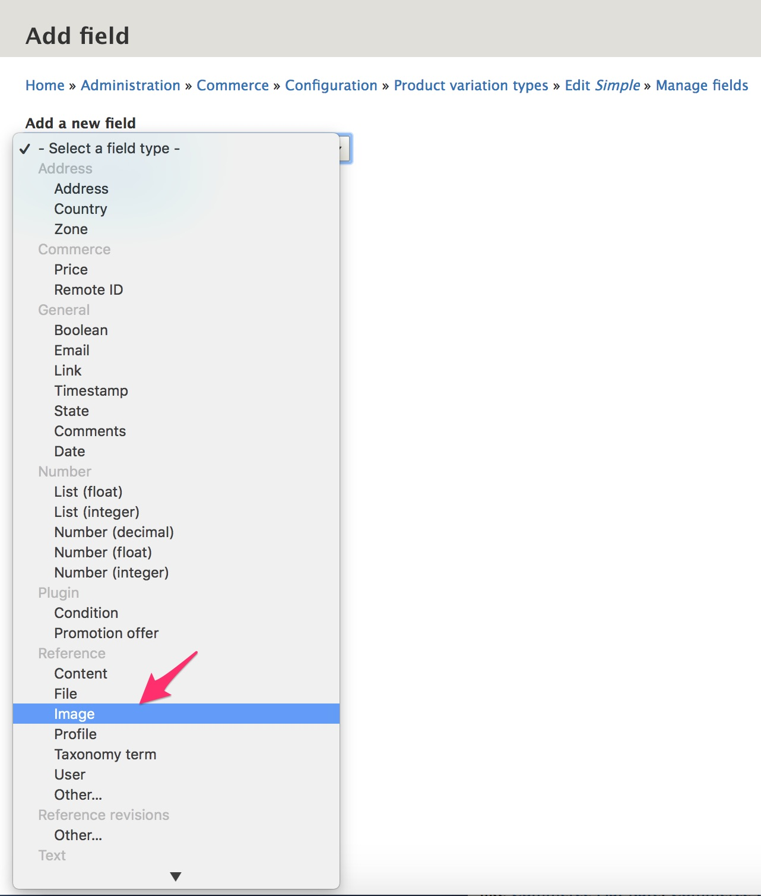
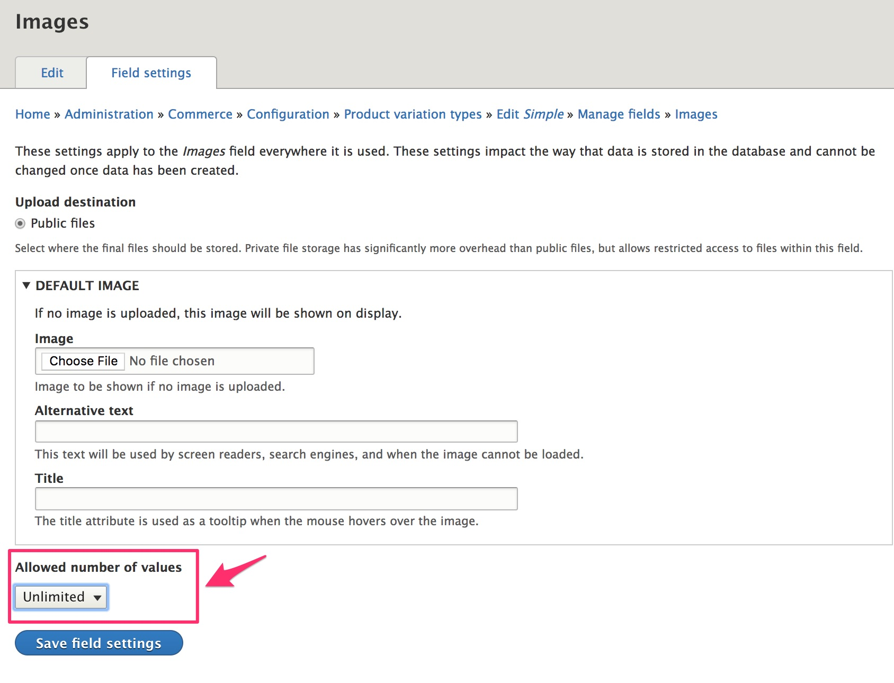
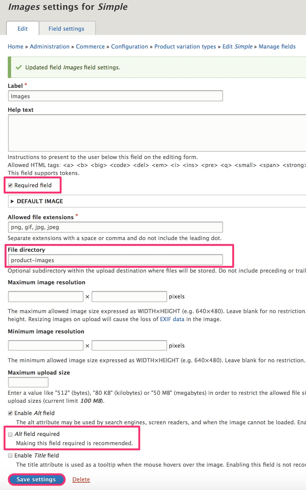

In this section, we're going to walk through the steps involved in creating a simple product type, one that has a single variation per product. We'll also add an image field for our variation type.

### Create a product type
To create a new product type:
1. Navigate to the "Product types" listing at `admin/commerce/config/product-types`
2. Click "Add product type".
3. Enter "Simple" for the Label. You can use the default settings for all other options.
4. Click the "Save" button.

#### Product type configuration options
##### Label
This is the name of the product type. The label field is only used for administrative purposes and will not be visible to end users.

##### Description
The description field is also only used for administrative purposes. It is displayed underneath the product type  on the "Add product" page, located at `/product/add`. If your store will have many different product types, entering a description for each can be helpful for product management.

##### Product variation type
Typically, each product type will have its own corresponding variation type, and you can create both the product type and product variation type at the same time, by selecting "Create new" for the "product variation type" on the "Add product type" form.

However, it is possible for a single product variation type to be used by multiple product types. In that situation, you could select an existing product variation type to be used by the product type you're creating. For example, suppose all your product variations need only the basic title/sku/price fields, but some of your products are manufactured internally while others are outsourced. You might need a variety of different product-level fields in this situation. You could also have different product types because of different marketing needs.

##### Inject product variation fields into the rendered product
This is a setting that affects how products are displayed for end users. You can learn more about [product variation field injection](../../04.displaying-products/01.product-display) in the [Displaying products](../../04.displaying-products) section of the documentation.

##### Publish new products of this type by default
"Published" is an option on the data entry form for products and can be checked (published) or unchecked (not published), by default. Also, it is possible to remove the "published" setting from the product form completely (for all or just a subset of administrative users). You can learn more about the [product data entry form](../../03.product-management/02.product-data-entry) configuration options in the [Product management](../../03.product-management) section of the documentation.

### Configure a product variation type
To access the configuration form for a product variation type, you can either navigate to the "Product variation types" listing at `/admin/commerce/config/product-variation-types` or use the "Product variation type" links on the "Product types" listing at `admin/commerce/config/product-types`.

On the "Product types" listing page, click the link for the "Simple" product variation type to configure the product variation-level options for the "Simple" product type.

If you have not created any "Product attributes", you should see a configuration form that looks like this:

Select the "Generate variation titles based on attribute values" setting to keep the data entry for our "Simple" product type as simple as possible. Click the "Save" button to save the updated product variation type configuration.

#### Product variation type configuration options
##### Label
By default, the label for a product variation type is the same as the label for the product type, but the labels do not need to be the same. The label is the name of the product variation type. The label field is only used for administrative purposes and will not be visible to end users.

##### Generate variation titles based on attribute values
- If this option is not selected, the "Title" field will be shown on the product variation data entry as a required field.
- If this option is selected, he "Title" field will not be shown on the data entry form for the product variation. Instead, the value for the product variation title will be automatically generated:
 - For a single-variation product type like our "Simple" product type, there are no attributes. The title of the product will also be used as the title for its product variation.
 - For product variation types with attributes, the generated title is the product title followed by a dash (-) and then a comma-separated list of its attribute values. For example, "Drupal Commerce Hoodie - Blue, Small" or "Drupal Commerce Hoodie - Green, Large".

##### Traits
If you have commerce-related contributed modules installed, you may see additional configuration options. For example, the [Commerce shipping module] will add a "Shippable" trait. See the documentation for the contributed modules for information about these traits.

##### Order item type
When a product variation is added to the cart, it is added as a new line item. The order item type defines the structure of this line item. (See some doc from the overview section.)

##### Attributes
If you have defined product attributes, they will be listed here. Select any attributes that are applicable to your product variation type.

### Add images to a product variation type
Custom fields of a variety of types can be added to your product variations. To add a field for one or more images to your Simple product variation type:
1. Navigate to the "Manage fields" page for the Simple product variation type: `/admin/commerce/config/product-variation-types/simple/edit/fields`
2. Click the "Add field" button.
3. Select field type "Image" (under Reference). (If you do not see "Image" as an option, make sure that the Drupal core [Image module] is enabled.)
4. Enter "Images" for the Label.
5. Click the "Save and continue" button.

On the "Field settings" configuration page:

6. Change the "Allowed number of values" from "Limited" to "Unlimited". Product variations of type "Simple" can have 1 or more images.
7. Click "Save field settings" to continue.

>You can use the default values for the rest of the Image field settings. If you are interested in learning more about the Image field settings options, see the Drupal 8 documentation for [Working with images], which is currently out of date. Until it has been updated, you may find this [Image Media Type Manage Fields Tab] documentation more helpful.

On the "Image settings for Simple" configuration page:

8. Select the "Required field" option to make images required for product variations of type "Simple".
9. Change the "File directory" to "product-images".
10. Deselect the "*Alt* field required" setting (to simplify data entry for this demonstration setup).
11. Click the "Save settings" button to finish configuring the new "Images" field.

Images can now be uploaded for Simple product variations and displayed on product pages. See [Product display pages](../../04.displaying-products/01.product-display) for documentation on customizing product displays.

You can use this same general approach to add other fields to both product and product variation types.

---
In the next section, we'll look at creating a more complex product type, with product attributes and multiple variations per product.

[Making Your Site Multilingual]: https://www.drupal.org/docs/user_guide/en/multilingual-chapter.html
[Commerce shipping module]: https://www.drupal.org/project/commerce_shipping
[Image module]: https://www.drupal.org/docs/8/core/modules/image
[Working with images]: https://www.drupal.org/docs/8/core/modules/image/working-with-images
[Image Media Type Manage Fields Tab]: http://webtech.training.oregonstate.edu/osu-drupal-8/technical-manual/working-structure/media-entity/image-media-type/image-media-type-manage-fields-tab
