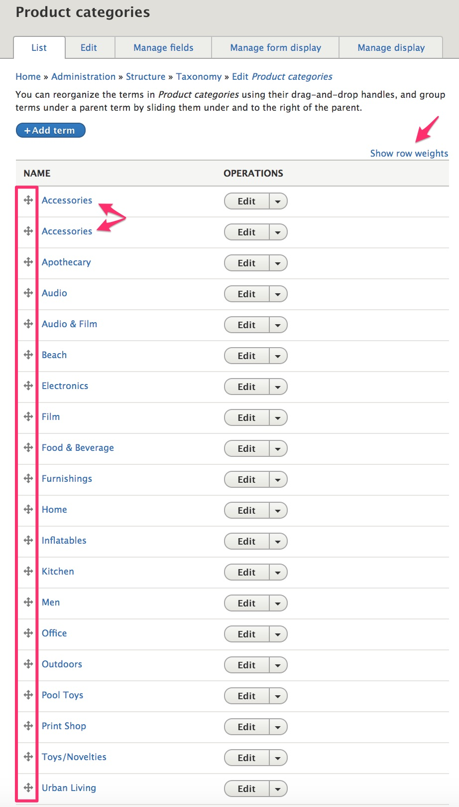
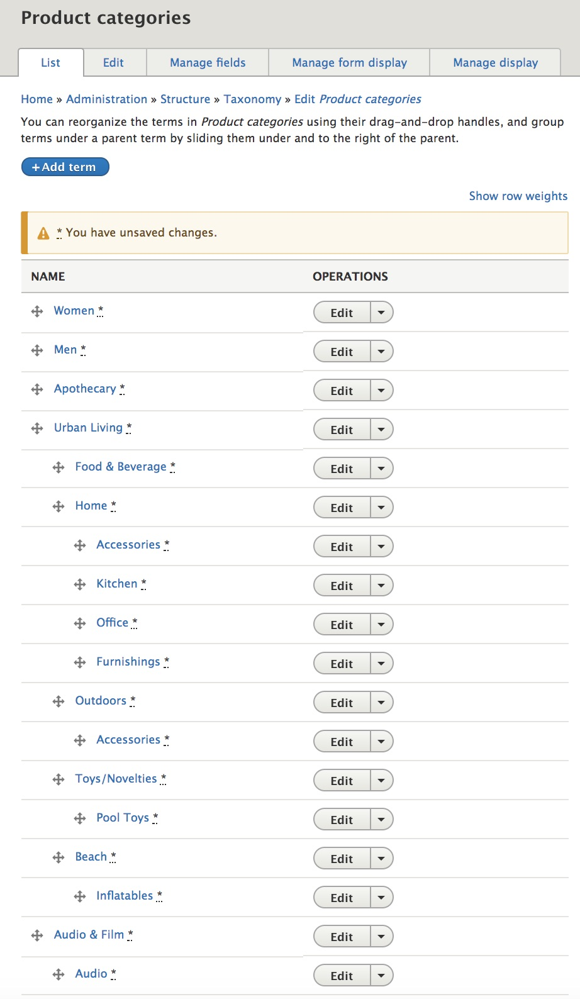
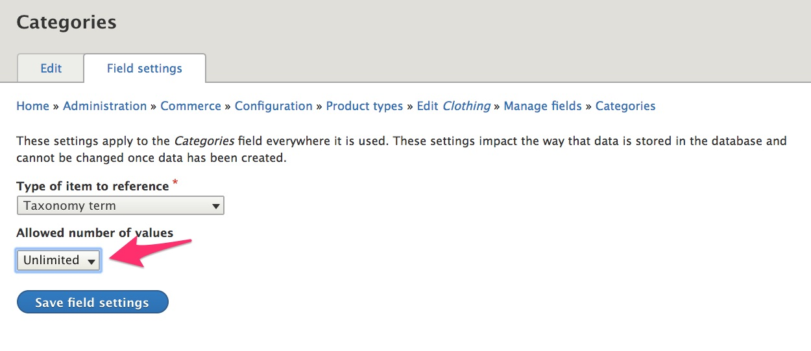

In the [Simple product type](../01.simple-product) documentation, we added a custom field to a *product variation type*, to allow product variations to have images. In the [Product type with attributes](../02.product-attributes) documentation, we added a custom field to a *product attribute*, to allow a Color attribute to be displayed as a color swatch image instead of just the color name. In this section, we're going to look at how to add fields to *product types* so that we can organize products into categories that can be used for the product catalog.

### Create a basic product category

Let's start by creating a *Brands* taxonomy to organize products by brand.

1. Navigate to the *Taxonomy* page at `/admin/structure/taxonomy`.
2. Click the *Add vocabulary* button.
3. Enter "Brands" for the Name.
4. Click *Save* to create the new vocabulary.

Now you can add terms to the vocabulary or look into using the [Feeds module] or [Migrate Tools module] to import your pre-existing data.

### Create a hierarchical product category
For our product catalog, we're also going to want to hierarchical categories so that customers can use faceted search to "drill down" to specific categories. For example, on the Commerce Demo site, we have an *Urban Living* product category with sub-categories of *Food & Beverage*, *Home*, *Outdoors*, etc. And within the *Home* category, we further classify products as *Accessories*, *Kitchen*, *Office*, or *Furnishings*.

To create a hierarchical taxonomy in Drupal, we can use the same steps we used to create a basic taxonomy. After creating a *Product categories* taxonomy and adding the terms, we have a listing that looks like this:

Notice that the *Accessories* term appears to be duplicated, but that's fine, since one of those terms will be a sub-category of the Urban Living *Home* category, and the other will be a sub-category of the Urban Living *Outdoors* category. They have the same label but are actually two completely separate terms.

To transform this simple listing into a hierarchical taxonomy, you just need to use the drag-and-drop icons in the leftmost column to rearrange the terms. You may also find it helpful to click the *Show row weights* link to set the order of terms within a particular category, especially if there are a great number of items. After moving items around, the Product categories taxonomy now looks like this and all we need to do is click the *Save* button to save the changes:

### Create a term reference field for your product category

Let's add a field that references our *Brands* taxonomy to the [Simple product type](../../02.product-architecture/01.simple-product) we previously created. (If you haven't created the *Simple* product type, you can use *Default* or any other product type.)

1. Navigate to the *Product types* page at `/admin/commerce/config/product-types`.
2. Select the *Manage fields* operation for the Simple product type.
3. Click the *Add field* button.

4. Select *Taxonomy term* (in the *Reference* section) for the new field type.
5. Enter *Brand* for the Label.
6. Click the *Save and continue* button.

7. Click *Save field settings* on the next page to save the default configuration values.
8. On the *Brand settings for Simple* page, select *Required field* and select *Brands* for the Vocabulary.
9. Click the *Save settings* button.

The *Brand* field has now been added to the Simple product type. To add the Brand field to another product type, you can *Re-use an existing field* to select this Brand field on the *Add field* page for the product type.

We can also create a new Taxonomy term reference field for our *Product categories* taxonomy and any other product taxonomies we want to create. Unlike the *Brand* field, which was limited to a single value, we'll specify *Unlimited* for the *Allowed number of values* for product categories:

To learn how to use the Brand and Taxonomy in a faceted product catalog, see the [Product catalog with facets documentation](../../05.marketing-products/02.product-catalog-facets).

### Links and resources
* Drupal 8 User Guide documentation on [Concept: Taxonomy]

---
In the next section, we'll look at options for product architectures in Drupal Commerce.

[Concept: Taxonomy]: https://www.drupal.org/docs/user_guide/en/structure-taxonomy.html
[Feeds module]: https://www.drupal.org/project/feeds
[Migrate Tools module]: https://www.drupal.org/project/migrate_tools
