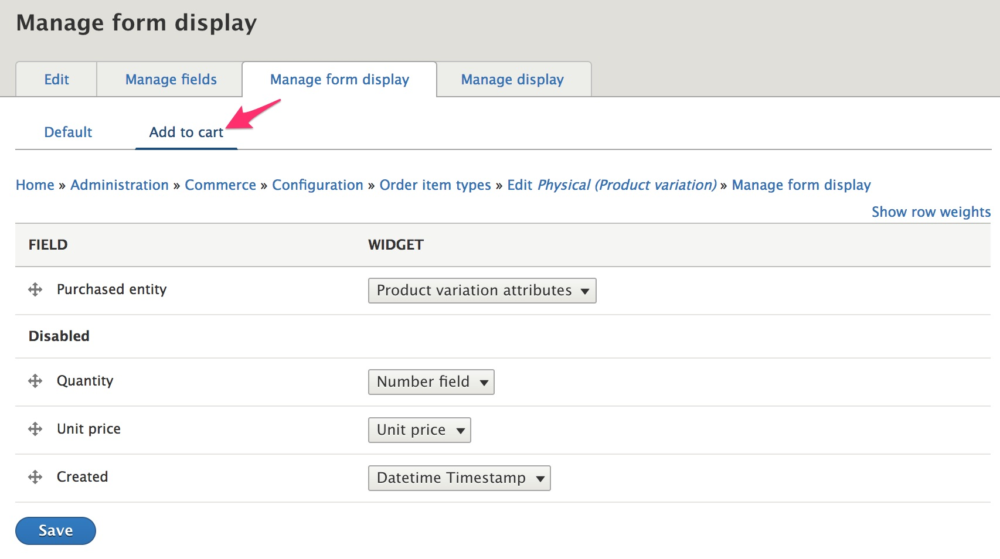
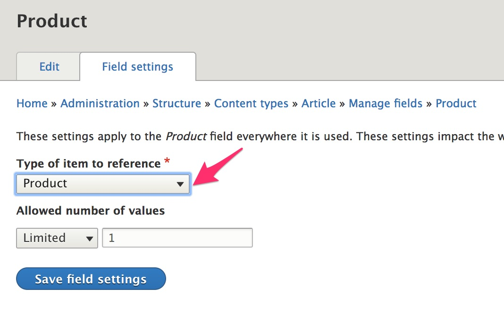

The "Add to cart form" allows customers to select a specific variation of a product and add that item to their Cart. In this section, we describe:
- How to add the Add to cart form to a product display page
- How to configure the form with specific examples for adding a "Quantity" field and fields for Customizable products
- How to add an Add to cart form to a custom content type page

#### Prerequisites
- Field formatters (link)
- Form display modes (link)
- Order item type configuration, purchased entity (link)
- Cart (link)

### Add the Add to cart form to your product display

In the previous section, we looked at how to customize product pages using the "Manage display" configuration form for product types. To include the Add to cart form on your product display, make sure the "Variations" field is enabled and set its Formatter to "Add to cart form". This formatter has a single configuration option:
"Combine order items containing the same product variation".

- If this setting is enabled, then whenever an item is added to the cart, existing items in the cart will be checked for matches. If a matching item is found, the quantity and price of that item will be increased.
- If the setting is not enabled, then any item added to the cart will appear in the cart and in the final order as a separate line item.

### Configuring the Add to cart form fields

The "Add to cart form" is implemented as a variant of the Order item content entity form.

> If you do not know which Order item type is used for your Product type, you can identify it by following these steps:
1. Navigate to the Product types listing at `/admin/commerce/config/product-types`
2. (after Issue #2911346 fixed) Click the product variation type link for your product type.
3. On the product variation type Edit form, identify the Order item type.

Once you've identified the correct Order item type for your Product type, navigate to the "Manage form display" configuration form for that type and then select the "Add to cart" form display option.

By default, "Purchased entity" is the only field enabled for the form. That field provides a mechanism for customers to select a product variation to be add to their cart.

If you would like to allow customers to enter additional information when adding items to the cart, enable the relevant fields here. For example, if the "Quantity" field is Disabled, then whenever a customer clicks the "Add to cart" button, 1 unit of the selected item will be automatically added. To allow customers to specify quantities other than 1 when they select an item:
1. Drag the "Quantity" field up and out of the "Disabled" section.
2. Select a Widget type for the "Quantity" field.
3. Click the "Save" button.

The "Quantity" field now appears on the Add to cart form for this product type.

#### Add fields for customizable products
If you have products with customization options, you can add fields to the Order item type, using the "Manage fields" form. Then add those fields to the Add to cart form for the Order item type. For example, a "Monogram" textfield has been added to the Add to cart form for this Order item type:

#### Customize the Purchased entity field

There are two widget options for the Purchased entity field:
- Product variation attributes
- Product variation title

**Product variation attributes** is the default widget, and it's the one that's been used for all the example images on this page. It renders the Add to cart form with an element for each attribute individually. (For example, Color and Size.) The details of how this works and configuration options will be covered in [the next section](../03.product-attributes).

**Product variation title** is a simpler widget option. It displays all available product variation options in a select element. The only configuration option is the label for the select element. The default label is "Please select" and can be hidden. Here is how the same Add to cart form pictured above looks when the widget is changed to Product variation title. (The "Add to cart" button is beneath the select element.)

Both widgets allow custom modules to apply their own filtering to the list of available product variations by subscribing to the `ProductEvents::FILTER_VARIATIONS` event. For more information on writing event subscribers in Drupal 8, [Drupal 8 Event Subscribers - the successor to alter hooks] and [Drupal 8: Hooks, Events, and Event Subscribers] are good introductory articles. The [Code Receipes](../10.code-recipes) section of the Products documentation also contains an example.

### Add the Add to cart form to a custom content type page

You can add the Add to cart form to a custom content type by adding an "Entity reference" field that references entity type "Product" and then configuring the display using any of the techniques described in [Product display pages](../01.product-display) and on this Add to cart documentation page. Here is an example for adding the Add to cart form to the "Article" content type.

1. Navigate to the "Manage fields" form for the Article content type and click the "Add field" button: `/admin/structure/types/manage/article/fields`

2. Select "Reference >> Other..." as the field type. On the next page, select "Product" as the "Type of item to reference".

3. If you have multiple product types, specify the product type(s) to reference on the next page.

4. Navigate to the "Manage display" form for the Article content type and select "Rendered entity" for the Product field formatter: `/admin/structure/types/manage/article/display`. (You may also want to hide the field's label.)

5. If you want to use a "View mode" other than the default, configure the "Rendered entity" formatter by specifying an alternative View mode.

6. For each product type specified in step #3, navigate to the "Manage display" form for the "View mode" specified in step #5. The Variations field should be enabled, with "Add to cart form" selected as its formatter.

---
In the next section, we'll look at configuration options for displaying a product's attributes, such as "Color" and "Size".

[Drupal 8: Hooks, Events, and Event Subscribers]: https://www.daggerhart.com/drupal-8-hooks-events-event-subscribers/
[Drupal 8 Event Subscribers - the successor to alter hooks]: https://www.computerminds.co.uk/drupal-code/drupal-8-event-subscribers-successor-alter-hooks
