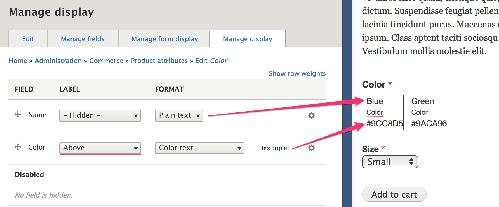

This section describes how you can modify the *Add to cart form* to do things like display a color swatch instead of just a color name for a customer to select.

#### Prerequisites
- [Add to cart form documentation](../02.add-to-cart-form)
- [Product attributes](../../03.products/01.product-attributes)

At the end of the [Add to cart form documentation page](../02.add-to-cart-form), we looked at the difference between the *Product variation attributes* widget and the *Product variation title*. To customize the display of individual product attributes, like Color or Size, the *Produc*t variation attributes* widget must be selected on the Add to cart form display for the product's order item type.

### Product attribute element types

There are three options for how a product attribute is displayed on the add to cart form. The first two options, radio buttons and select list, simply display the Name of each value for the attribute. In the image above, the Size attribute values are displayed with the Select list element type. It is the third option, Rendered attribute, that provides functionality for displaying attributes in alternative ways.

#### Rendered attribute element type
The rendered attribute element type works by using the Add to Cart Form view display mode for the product attribute. (The default display mode for the product attribute is used if the Add to Cart Form display mode is not explicitly enabled.)

To access this administrative UI, navigate to your list of Product attributes at `/admin/commerce/product-attributes` and click the "Edit" button for the product attribute. Select "Rendered attribute" for the Element type and then click the "Save" button at the bottom of the page.

Next, navigate to the *Manage display* tab, where you'll see the Name field as well as any additional fields you added for this product attribute. Here we've left the Color product attribute (that we created in the ..docs) configured with its defaults. You can see that the Name field label is hidden, but the Color field label is displayed above the color text, which is displayed as its hex value.

Now, to get the color swatches appearing as we'd like, we'll move the *Name* field to he Disabled section, hide the *Color* field label, change its Format to *Color swatch* and adjust its configuration like this:

A similar approach could be taken for displaying an attribute as an image:
1. Add an Image field to the product attribute.
2. Select *Rendered attribute* as the Element type.
3. Configure the attribute's display so that only the image field is rendered.

### Theming product attributes
If you are not familiar with theming in Drupal, you will want to read the next section of documentation on theming Products in general before looking at specific theming options for product attributes. Theming allows you to further customize the display of product attributes, beyond what is possible using only the administrative UI.

Drupal commerce provides a specific template that can be overriden for product attributes:
- `commerce-product-attribute-value.html.twig`

Also, there is a custom css library for rendered product attributes, located within the Drupal Commerce Product module: `css/commerce_product.rendered-attributes.css`. There are two classes attached to the rendered product attribute element that can be targeted with custom styling:
- `product--rendered-attribute`
- `product--rendered-attribute__selected`

---
In the next section, product theming...

[Drupal 8: Hooks, Events, and Event Subscribers]: https://www.daggerhart.com/drupal-8-hooks-events-event-subscribers/
[Drupal 8 Event Subscribers - the successor to alter hooks]: https://www.computerminds.co.uk/drupal-code/drupal-8-event-subscribers-successor-alter-hooks
