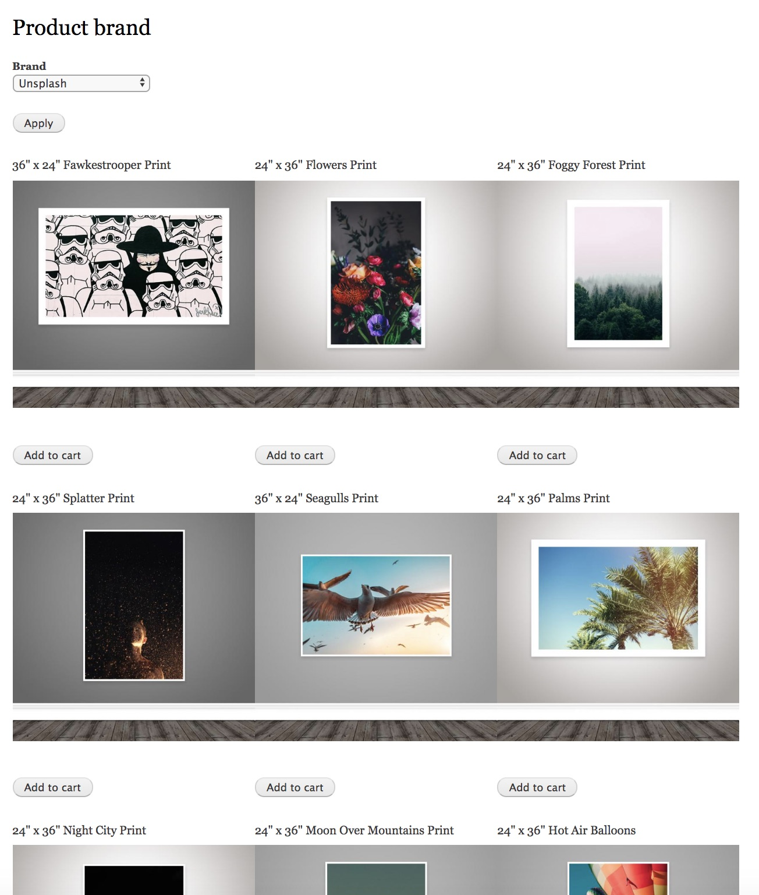
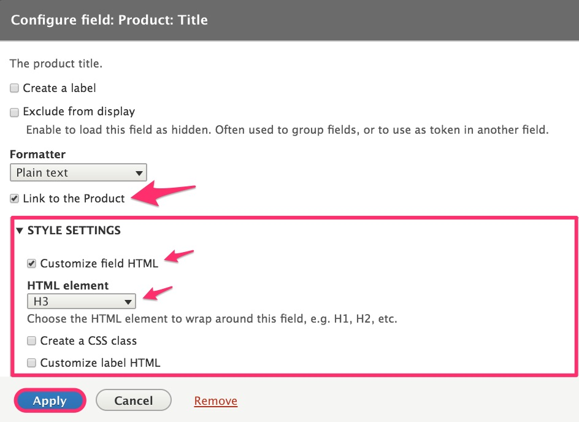
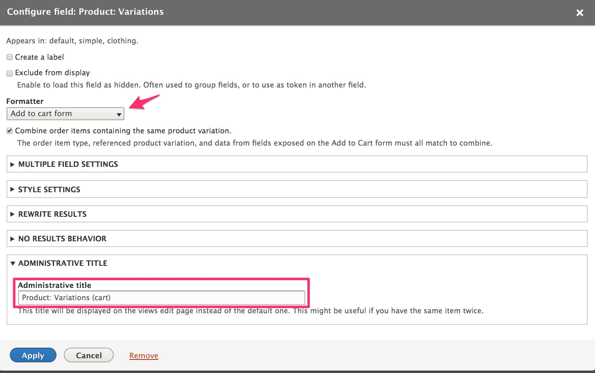

This section describes how you can create a page that displays multiple products, with [Add to cart forms](../02.add-to-cart-form), using the [Drupal Views module]. In the [Product categories documentation](../../02.product-architecture/03.product-categories), we added a "Brand" field to our product types. In this example, we'll create a page that displays all products for a user-specified brand.

#### Create the Product Brand View

1. Navigate to the Views administration page at `/admin/structure/views`.
2. Click the "Add view" button.
3. Under "View basic information", enter "Product brand" for the "View name".
4. Under "View settings", select "Product" of type "All".
5. Under "Page settings", check the "Create a page" checkbox.
 - Select "Grid" for the "Display format".
 - Enter "12" for the number of "Items to display".
6. Click "Save and edit" to create the new view.

#### Configure the Product Brand View fields
##### Product title field
The "Product: Title" field has already been added for us. Click on the "Product: Title" link to configure the field:
 1. Select "Link to the Product".
 2. Click on "Style Settings" and select "Customize field HTML" and "H3" for the "HTML element".
 3. Click the "Apply" button.

##### Variations image field
Our products don't have images, but their variations do have one or more images. We'll display the first image of the first variation for each product. To do this, we'll use the "Single image" view mode that we created in the [Product images documentation](../06.product-images).

**Add the Variations field**
1. Click the "Add" button in the "Fields" section.
2. Select the "Variations" item.
3. Click the "Add and configure fields" button.

**Configure the Variations field.**
1. Select "Rendered entity" for the Formatter.
2. Select "Single image" for the View mode.
3. Click on "Multiple Field Settings" and enter "1" to "Display 1 value(s)".
4. Click on "Administrative Title" and enter "Product: Variations (image)" for the Administrative title.
5. Click the "Apply" button.

##### Add to Cart variations field
If you're not familiar with the Add to Cart form, see the [Add to cart form documentation page](../02.add-to-cart-form). We'll add the Product Variations field a second time and configure it as an Add to cart form.

**Add the Variations field**
1. Click the "Add" button in the "Fields" section.
2. Select the "Variations" item.
3. Click the "Add and configure fields" button.

**Configure the Variations field**
1. Select "Add to cart form" for the Formatter.
2. Click on "Administrative Title" and enter "Product: Variations (cart)" for the Administrative title.
3. Click the "Apply" button.

#### Add a filter for the product brand
At this point, our view is set up to show *all* products that are published/active. We need add a filter to allow users to filter by product brand. To do that, use the "Filter criteria" section of the View administration page.

**Add the Brand filter**
1. Click the "Add" button next to "Filter criteria".
2. Select "Brand (field_brand)" on the "Add filter criteria" form.
3. Click "Add and configure criteria".
4. On the next form, select the "Brands" vocabulary and the "Dropdown" selection type.
5. Click "Apply and continue".

**Configure the Brand filter**
1. Select "Expose this filter to visitors, to allow them to change it".
2. Enter "Brand" for the Label.
3. Click the "Apply" button.

### Customize the page display
The View configuration form can be used to customize your page display in a variety of ways, such as:
* Change the Grid settings to display 3 columns instead of 4.
* Add sort criteria.
* Using Page Settings, change the path or create a menu for the page.
* Instead of using an exposed filter, add a contextual filter to create a separate page for each brand.

---
In the next section...

[Drupal Views module]: https://www.drupal.org/docs/8/core/modules/views