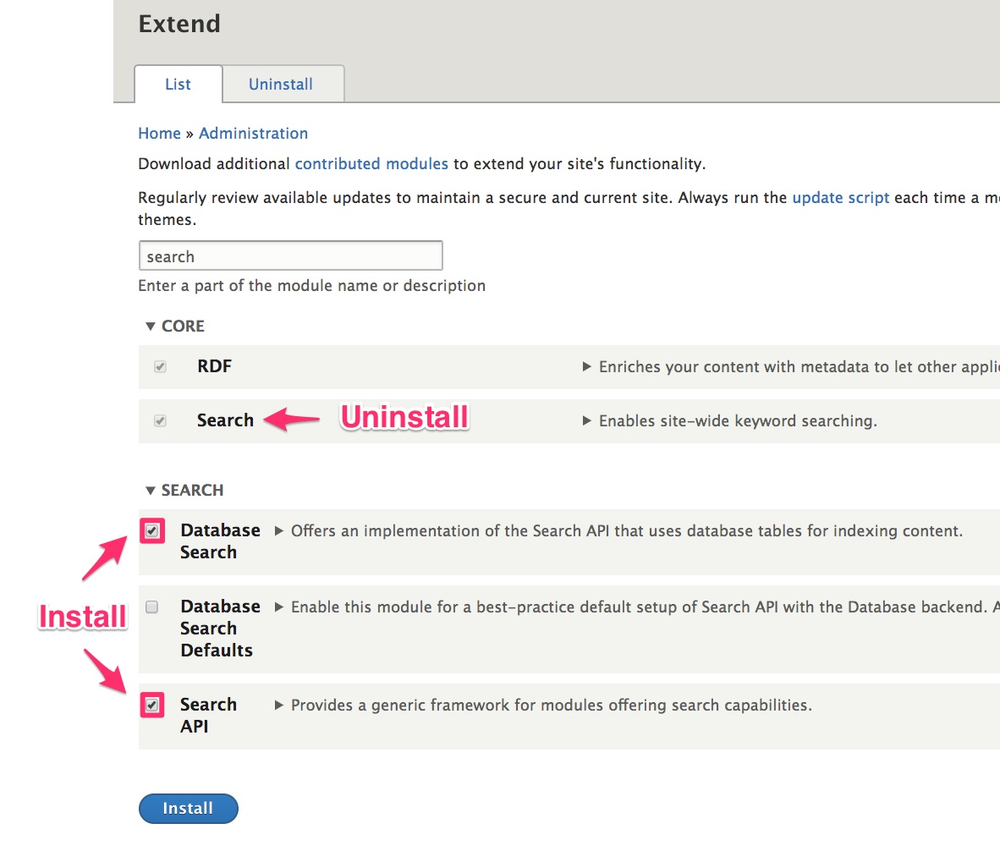
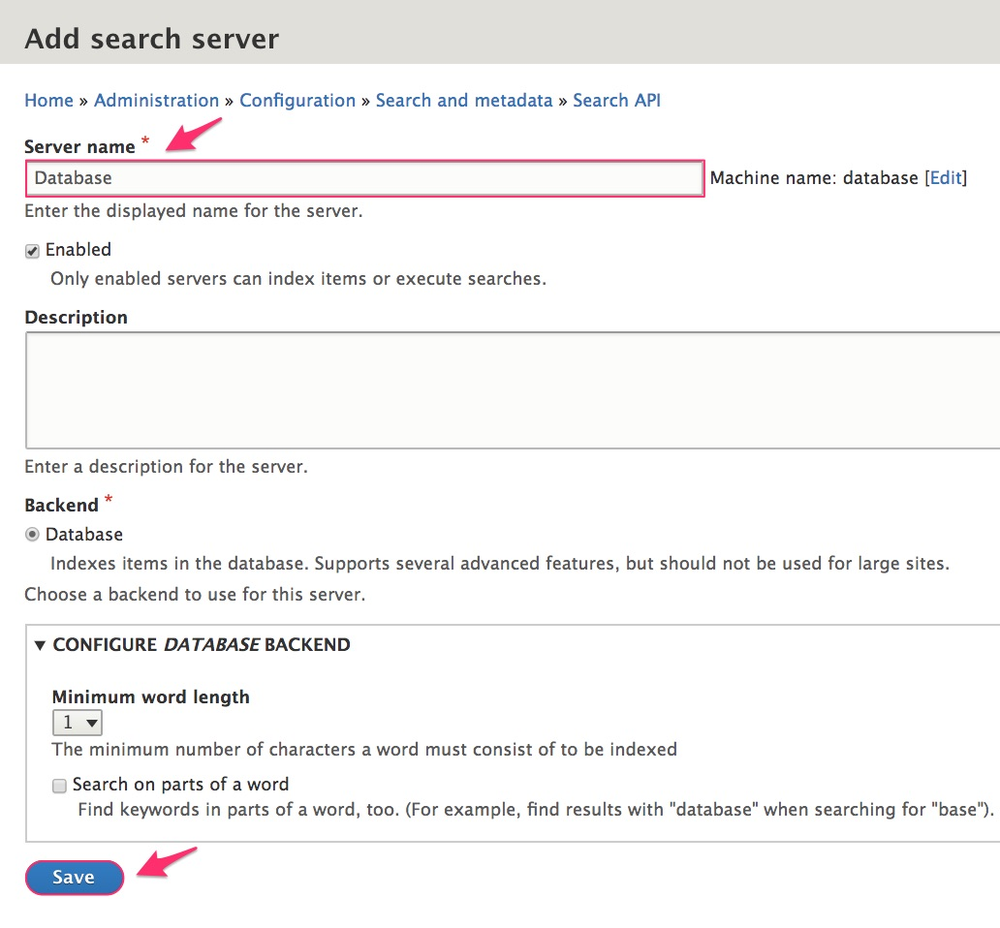
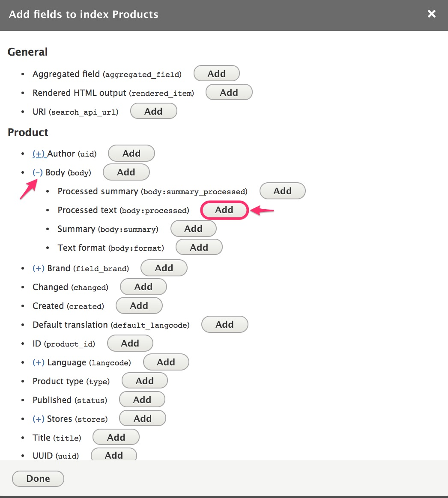
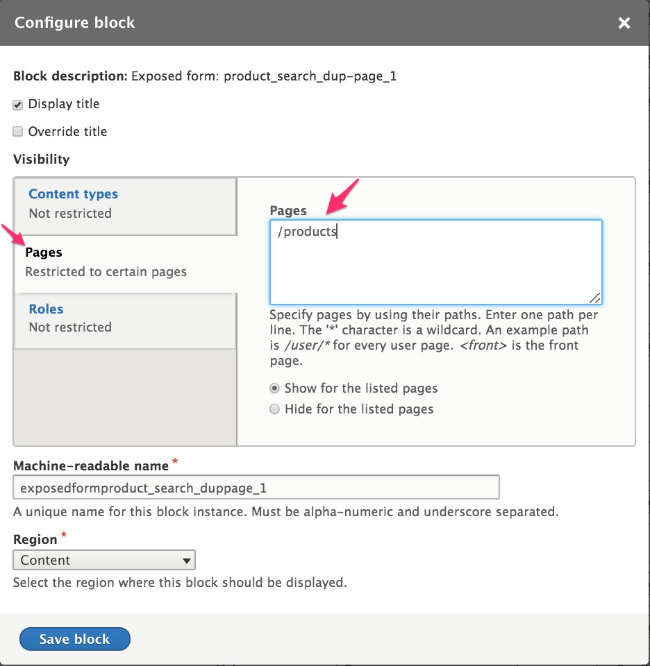

In this section we'll walk through the process of using the [Search API module] and the Drupal 8 core [Views module] to create a basic product search page like this:

### Configure Search API module for product search
Search API is a contributed module that provides a framework for creating searches on Drupal entities. The general steps for setting up search functionality for products (or any type of data) with Search API are:

**Step 1:** [Install the Search API module and uninstall the "Search" module provided by Drupal 8 Core.](#step-1-install-search-api-modules)
 - Typically, you will want to uninstall the Core Search module for performance reasons.

**Step 2:** [Add a search server with Drupal's own database as the search backend.](#step-2-add-a-server)
 - Typically, most sites will want to use a more powerful backend like Solr or Elasticsearch instead of Drupal's own database..

**Step 3:** [Add an index for products.](#step-3-add-an-index)
 - The index's settings determine what data is indexed and how it is indexed.

**Step 4:** [Specify which product fields should be indexed and set their data types and weights.](#step-4-select-the-indexed-fields)
 - The data type of a field determines how it can be used for searching and filtering.
 - A "boost" value is used to give additional weight to fields to affect the ordering of the search results.

**Step 5:** [Enable some basic processors for our index.](#step-5-configure-processors)
 - The [Processors page] in the Search API documentation guide provides a good overview of processor options.

##### Step 1: Install Search API modules
1. Add the [Search API module] to your site. (*See the [documentation on extending Drupal Commerce](../../../02.install-update/06.extending).*)
2. Navigate to the "Extend" page at `/admin/modules`.
3. Install the "Database Search" and "Search API" modules.
4. Also, it is recommended that you *uninstall* the Core "Search" module whenever you are using Search API.

##### Step 2: Add a server
1. Navigate to the Search API configuration page at `/admin/config/search/search-api`.
2. Click the "Add server" button to add a server.
3. Enter "Database" for the server name.
4. Click the "Save" button.

##### Step 3: Add an index
1. Return to the Search API configuration page at `/admin/config/search/search-api`.
2. Click the "Add index" button to add an index.
3. Enter "Products" for the index name.
4. Scroll down the list of "Data sources" until you see "Product".
5. Select "Product" as the type of data you want to index and search with this index.
6. Select "Database" (*the server we just created*) for the "Server".
7. Click the "Save and add fields" button.

##### Step 4: Select the indexed fields
1. Navigate to the Search API field management administration page at `/admin/config/search/search-api/index/products/fields`.
2. Use the "Add fields" button to select all the field properties you want indexed. Search API will store data on the search server for each of these fields. In some cases, you will need to drill down into the options to locate the exact property you want. For example, for the Product Body field, it's the "Processed text" property that we actually want to index and search by:

3. Specify the Type for each of the added fields. We've added Title, Product variation SKU, and Product variation Title fields to this search index. Since we want to be able to find individual words contained in our search fields, not just the whole field value, select "Fulltext" for each of the fields. (You can use non-Fulltext field types when you only want to use a field for filtering or sorting.)
4. Set the Boost value for each of the added fields. Fields with higher boost scores will be "boosted" towards the top of the search listings. For example, if the Product Title has a boost score of 5, and other fields only have a boost score of 1, then products with the search term in their title will appear higher in the search results than products that only have the term in other fields.

##### Step 5: Configure processors
1. Navigate to the Search API processors administration page at `/admin/config/search/search-api/index/products/processors`.
2. Enable the processors you want to use. We'll select "Entity status", "HTML filter", and "Ignore case".
3. You can use the default settings for the "Processor order" settings.
4. Then, for each of the selected processors, you may have some additional settings to configure:
 - For the "HTML filter" processor settings, we only need the processor to be enabled for the product Body field. So deselect the other options. Leave the "Tag boosts" as is.
 - For the "Ignore case" processor settings, just use the default settings.

### Create a basic product search page
Next, we'll set up a basic search page for our indexed data using Views and the Drupal core Block layout functionality.

##### Step 1: Create a products search view
1. Navigate to the Views administration page at `/admin/structure/views` and click the "Add view" button.
2. Enter "Product search" for the view name.
3. Select "Index Products" for the "Show" setting, under "View settings". This is the index we created previously and named "Products".
4. Select "Create a page", under "Page settings".
5. Enter "Products" for the page title and "products" for the path.
6. For the "Page display settings", select "Unformatted list" of "Fields".
5. Click the "Save and edit" button.

##### Step 2: Configure the products search view
1. In the Fields section, remove the "Product datasource: Body >> Processed text" field.
2. In the Fields section, add and configure the "Product datasource: Title" field.
  * Select the "Summary or trimmed" formmater.
  * Enter "300" for the "Trimmed limit"
3. In the Fields section, add and configure the "Product datasource: Body" field.
  * Select the "Link to the Product" option.
4. In the Filter criteria section, add and configure the "Fulltext search" item:
 - Select "Expose this filter to visitors, and allow them to change it".
 - Enter "Search products" for the "Label".
 - Select "Contains any of these words" for the "Operator".

5. In the Sort criteria section, add and configure the "Relevance" option.
 - Select "Sort descending" for the "Order".
6. In the Exposed form section of the "Advanced" settings, click the "No" link next to "Exposed form in block" to change the setting to "Yes".
7. In the Exposed form section of the "Advanced" settings, click the "Settings" link next to "Exposed form style" to change the "Submit button text" to "Search".
8. Click the "Save" button to save your changes.

##### Step 3: Add the search block to your pages
1. Navigate to the "Block layout" administration page at `/admin/structure/block`.
2. Click the "Place block" button for the "Content" region.
3. Click the "Place block" button for the "Exposed form: product_search-page_1" block.
4. Set the Visibility settings so that the block only appears on the `/products` page.

5. Rearrange the "Content" blocks so that the "Exposed form: product_search-page_1" block appears right below the "Page title" block.
6. Click the "Save blocks" button at the bottom of the page.
7. Navigate to your Products search page at `\products` to try your new search form.

Optionally, you may want to add a menu link to the `\products` page or add the search block to all pages, perhaps in the Header region.

### Links and resources
* [Search API module documentation]
* Drupal 8 User Guide documentation on [Creating Listings with Views]
* Drupal 8 User Guide documentation on [Concept: Blocks]

---
In the next section, we'll look at how we can extend this basic product search with facets to create a product catalog for our site.

[Search API module]: https://www.drupal.org/project/search_api
[Views module]: https://www.drupal.org/docs/user_guide/en/views-chapter.html
[Creating Listings with Views]: https://www.drupal.org/docs/user_guide/en/views-chapter.html
[Concept: Blocks]: https://www.drupal.org/docs/user_guide/en/block-concept.html
[Search API module documentation]: https://www.drupal.org/docs/8/modules/search-api
[Processors page]: https://www.drupal.org/docs/8/modules/search-api/getting-started/processors
