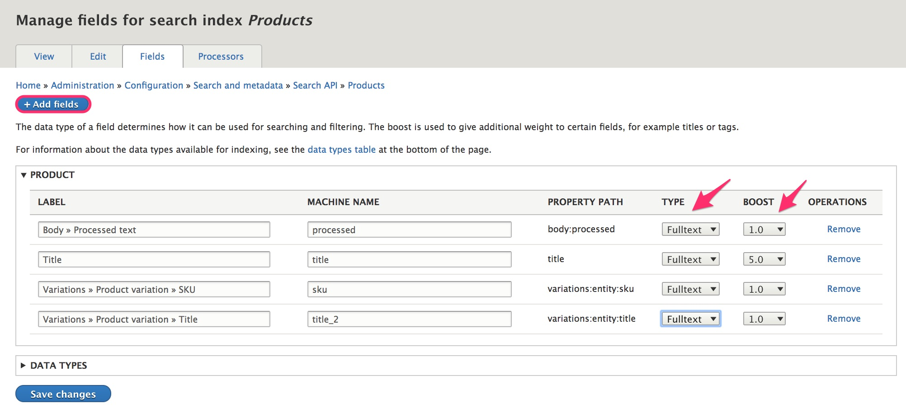
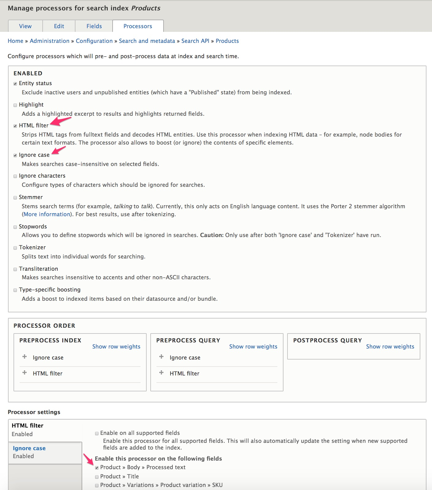
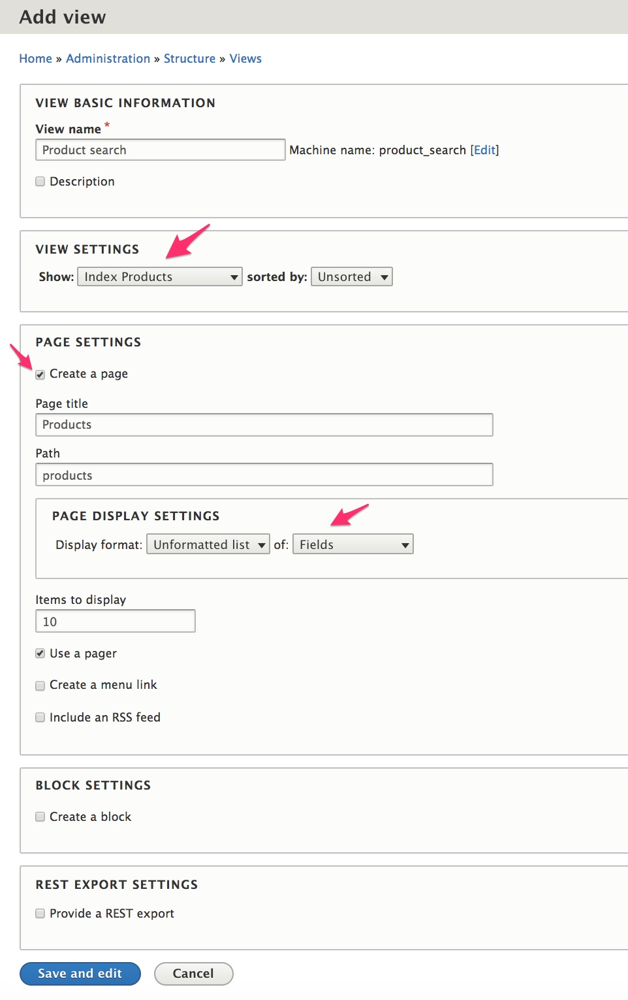
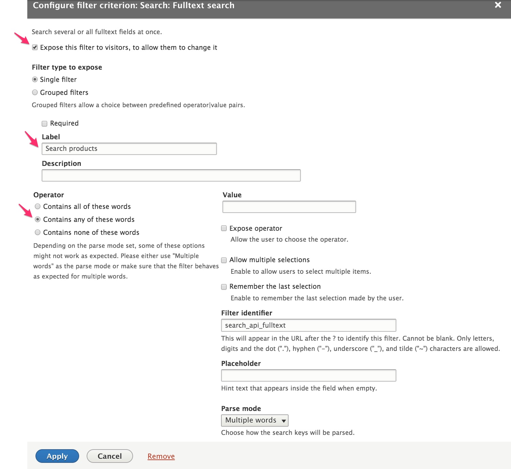

In this section we'll walk through the process of using the [Search API module] and the Drupal 8 core [Views module] to create a basic product search page like this:

#### Configure Search API module for product search
Search API is a contributed module that provides a framework for creating searches on Drupal entities. To setup product search functionality with Search API, we'll:
1. [Install the Search API module and uninstall the "Search" module provided by Drupal 8 Core.](#1-install-search-api-modules)
 - Typically, you will want to uninstall the Core Search module for performance reasons.
2. [Add a search server with Drupal's own database as the search backend.](#2-add-a-server)
 - Typically, most sites will want to use a more powerful backend like Solr or Elasticsearch.
3. [Add an index for products.](#3-add-an-index)
 - The index's settings determine what data is indexed and how it is indexed.
4. [Specify which product fields should be indexed and set their data types and weights.](#4-select-the-indexed-fields)
 - The data type of a field determines how it can be used for searching and filtering.
 - A "boost" value is used to give additional weight to fields to affect the ordering of the search results.
5. [Enable some basic processors for our index.](#5-configure-processors)
 - The [Processors page] in the Search API documentation guide provides a good overview of processor options.

##### 1. Install Search API modules
1. Install the [Search API module]. (*see the extending docs.*)
2. Navigate to the "Extend" page at `/admin/modules`.
3. Install the "Database Search" and "Search API" modules.
4. Also, it is recommended that you *uninstall* the Core "Search" module whenever you are using Search API.

##### 2. Add a server
1. Navigate to the Search API configuration page at `/admin/config/search/search-api`.
2. Click the "Add server" button to add a server.
3. Enter "Database" for the server name.
4. Click the "Save" button.

##### 3. Add an index
1. Return to the Search API configuration page at `/admin/config/search/search-api`.
2. Click the "Add index" button to add an index.
3. Enter "Products" for the index name.
4. Scroll down the list of "Data sources" until you see "Product".
5. Select "Product" as the type of data you want to index and search with this index.
6. Select "Database" (*the server we just created*) for the "Server".
7. Click the "Save and add fields" button.

##### 4. Select the indexed fields
Add fields for all properties for which you want to store data on the search server.
We'll select all the fields we want indexed for our search. Explain this here...
Title, Body: Processed text, Variations (SKU and title)
Only fulltext fields can be used in fulltext searched. Use it to find individual words contained in this field, not just the whole field value. completely searched for filtering.
Boost value affects score, weighting.
Re-do this image with all fields having fulltext.

##### 5. Configure processors
1. Enable the processors you want to use. We'll select "Entity status", "HTML filter", and "Ignore case".
2. We'll use the default settings for the "Processor order" settings.
3. For the "HTML filter" processor settings, we only need the processor to be enabled for the product Body field. So deselect the other options. We'll leave the "Tag boosts" as is.
4. For the "Ignore case" processor settings, we'll just use the default settings.

#### Create a products search view
1. Navigate to the Views administration page at `/admin/structure/views` and click the "Add view" button.
2. Enter "Product search" for the view name.
3. Select "Index Products" for the "Show" setting, under "View settings". This is the index we created previously and named "Products".
4. Select "Create a page", under "Page settings".
5. Enter "Products" for the page title and "products" for the path.
6. For the "Page display settings", select "Unformatted list" of "Fields".
5. Click the "Save and edit" button.

##### Configure the products search view
fix this here for fields instead of rendered entity...
1. Click on the "Settings" link to the right of "Show: Rendered entity", in the "Format" section, and change the "View mode" for each product type to "Search".
2. Click on the "Add" button in the "Filter criteria" section, select the "Fulltext search" option, and click the "Add and configure filter criteria" button.
3. Configure the Fulltext search filter:
 - Select "Expose this filter to visitors, and allow them to change it".
 - Select the "Required" option.
 - Enter "Search products" for the "Label".
 - Select "Contains any of these words" for the "Operator".

4. Click on the "Add" button in the "Sort criteria" section, select the "Relevance" option, and click the "Add and configure sort criteria" button. Select "Sort descending" for the "Order".
5. In the "Exposed form" section of the "Advanced" settings, click the "No" link next to "Exposed form in block" to change the setting to "Yes".
6. Also in the "Exposed form" section of the "Advanced" settings, click the "Settings" link next to "Exposed form style" to change the "Submit button text" to "Search".
7. Click the "Save" button to save your changes.

#### Add the search block to your pages
1. Navigate to the "Block layout" administration page at `/admin/structure/block`.
2. Click the "Place block" button for the "Header" region.
3. Click the "Place block" button for the "Exposed form: product_search-page_1" block.

This isn't working...I think because of the product template. Need to use fields instead, I think... Yes, need to re-write this to use fields instead of rendered entity.

### Links and resources
* Drupal 8 User Guide documentation on [Creating Listings with Views]
* Drupal 8 User Guide documentation on [Concept: Blocks]
* [Search API module documentation]

---
In the next section, we'll look at how we can extend this basic product search with facets to create a product catalog for our site.

[Search API module]: https://www.drupal.org/project/search_api
[Views module]: https://www.drupal.org/docs/user_guide/en/views-chapter.html
[Creating Listings with Views]: https://www.drupal.org/docs/user_guide/en/views-chapter.html
[Concept: Blocks]: https://www.drupal.org/docs/user_guide/en/block-concept.html
[Search API module documentation]: https://www.drupal.org/docs/8/modules/search-api
[Processors page]: https://www.drupal.org/docs/8/modules/search-api/getting-started/processors
