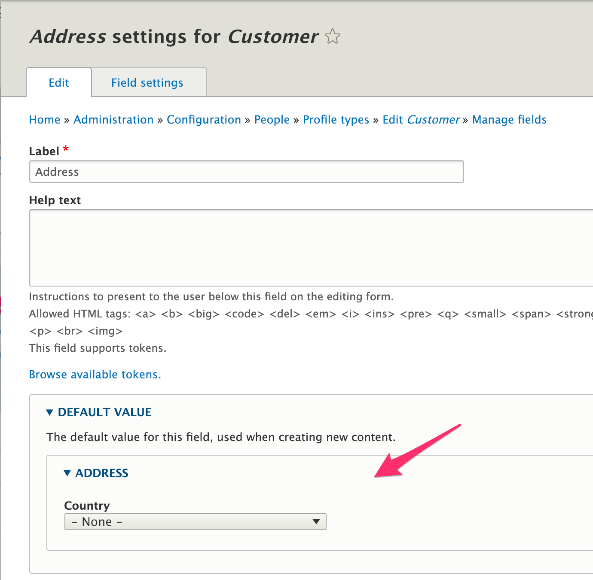

The Address module provides a custom *Country* field type along with a custom form element, default formatter, and default widget. Country data is stored internally using standard 2-letter codes. Country codes are limited to the list of available countries.

### What is the list of available countries and how can I change it?
The *Commerce Guys Addressing library* provides a list of countries, with translations for over 250 locales. This library is a requirement for the Drupal Address Module (and part of the reason why you ought to use Composer to manage your Drupal Commerce project). The dataset is stored locally in JSON format. For the actual list, see the *CountryRepository* class: `commerceguys/addressing/src/Country/CountryRepository.php`. The *CountryRepository* class provides methods to retrieve this country data. Within the *Address* module, the *CountryRepository* service extends the *CountryRepository* class provided by the Addressing library and manages the cache backend.

Whenever a field type wants to provide a list of *available* countries for a select list, it can use the ***AvailableCountriesTrait*** and its ***getAvailableCountries()*** method. The Address module's *country*, *zone*, and *address* fields all use the *AvailableCountriesTrait*. You can customize the list of countries returned by the *AvailableCountriesTrait* by subscribing to the `AddressEvents::AVAILABLE_COUNTRIES` event. Here is a simple example of an event subscriber for the available countries event:

```php
<?php

namespace Drupal\my_module\EventSubscriber;

use Drupal\address\Event\AddressEvents;
use Drupal\address\Event\AvailableCountriesEvent;
use Symfony\Component\EventDispatcher\EventSubscriberInterface;

class AddressTestEventSubscriber implements EventSubscriberInterface {

  /**
   * {@inheritdoc}
   */
  public static function getSubscribedEvents() {
    $events[AddressEvents::AVAILABLE_COUNTRIES][] = ['onAvailableCountries'];
    return $events;
  }

  /**
   * Alters the available countries.
   *
   * @param \Drupal\address\Event\AvailableCountriesEvent $event
   *   The available countries event.
   */
  public function onAvailableCountries(AvailableCountriesEvent $event) {
  	$countries = ['AU' => 'AU', 'BR' => 'BR', 'CA' => 'CA', 'GB' => 'GB', 'JP' => 'JP'];
    $event->setAvailableCountries($countries);
  }

}
```

#### How do I set the default country for customers?
*Default country* is a setting for the default *Address* widget. To set the default country for customers, you need to configure the *Form display* for the *Customer* profile type. This administration page is located at `/admin/config/people/profiles/manage/customer/form-display`. Click on the gear for the Address field to alter the setting:


