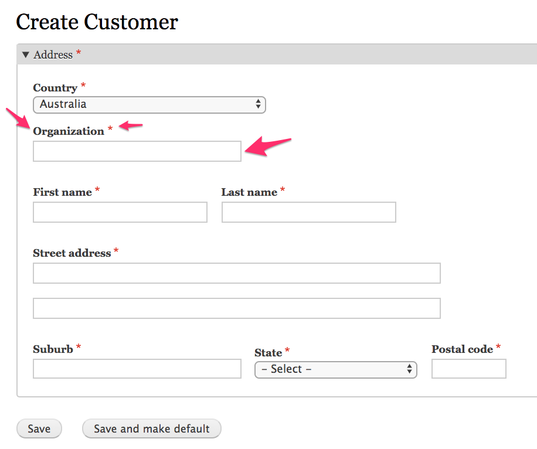
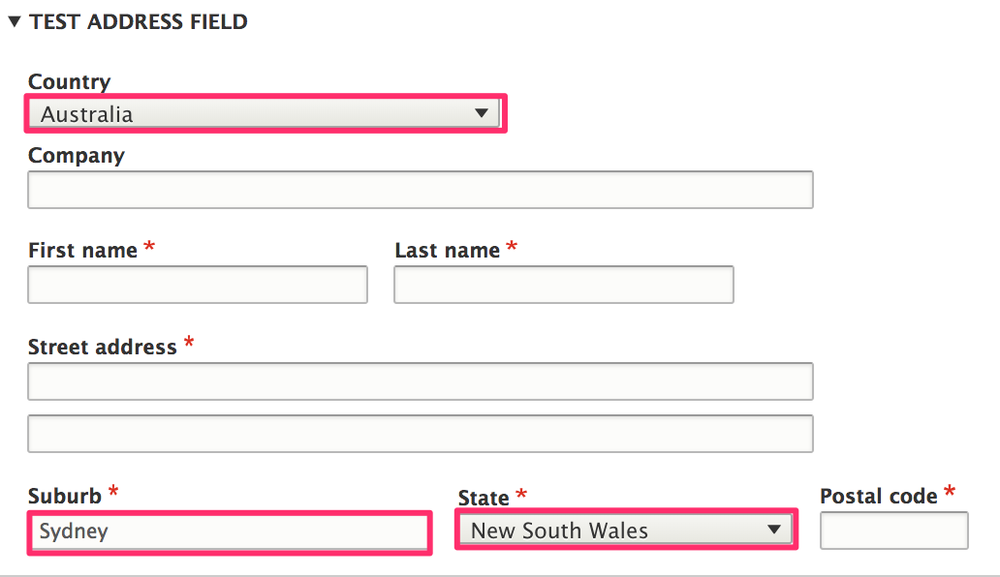

This documentation page describes how you can customize address fields as they appear on forms.

* [Setting field overrides](#setting-field-overrides) describes how to control which address fields appear on forms and whether they are required.
* [Altering address fields on forms](#altering-address-form-fields) describes how to change field labels and make other alterations.
* [Setting initial values for address fields](#setting-initial-values-for-address-fields) describes how to set default values for address fields.

### Setting field overrides
For each address field (First name, middle name, last name, etc.), you can specify an *override* setting. By default, the data in the Commerce Guys *Addressing* library is used to determine how fields should be used for a specific country.

The options are:

| Setting  | Behavior |
| ---------| -------- |
| Hidden   | Field will not be used. |
| Optional | A field that is normally required will be optional. |
| Required | The field will be required. This will only apply if the address format uses the field. |


Administrative users can configure field override settings for an address field by navigating to a content entity type's *Manage fields* administrative page and then clicking on the address field's *Edit* operations link. Here, an address field named *Test address field* has been added to the *Basic page* content type. This page is located at `/admin/structure/types/manage/page/fields`:


#### Field overrides for locked address fields
If your address field is locked, you won't be able to use the address field's *Manage fields* administrative page to set field overrides. However, you can implement `hook_form_alter()` to programmatically set override values.

For example, suppose you want to set overrides for the address field that appears on *Customer* profiles. Here we set override values for the organization, locality, and postal code field

```php
<?php

use Drupal\Core\Form\FormStateInterface;

function mymodule_form_alter(&$form, FormStateInterface $form_state, $form_id) {
  if (($form_id == 'profile_customer_edit_form') || ($form_id == 'profile_customer_add_form')) {
    $form['address']['widget'][0]['address']['#field_overrides'] = [
      'organization' => 'required',
      'locality' => 'optional',
      'postalCode' => 'hidden',
    ];
  }
}
```

### Altering address form fields
The default address widget uses the custom *address* form element. As a result, you cannot use `hook_form_alter()` or `hook_field_widget_form_alter()` directly. Instead, you need to add an `#after_build` callback to the address form element and then alter it from there.

#### Example 1: Customize the *Company* field
In this example, we'll made the following customizations to the *Company* field:
* Change the "Company" label to "Organization".
* Change the textfield size from 60 to 30.
* Make the field required.

```php
<?php

use Drupal\Core\Form\FormStateInterface;

function mymodule_form_alter(&$form, FormStateInterface $form_state, $form_id) {
  if (($form_id == 'profile_customer_edit_form') || ($form_id == 'profile_customer_add_form')) {
    $form['address']['widget'][0]['address']['#after_build'][] = 'mymodule_customize_address';
  }
}

function mymodule_customize_address($element, $form_state) {
  $element['organization']['#title'] = t('Organization');
  $element['organization']['#size'] = 30;
  $element['organization']['#required'] = TRUE;
  return $element;
}

```


#### Example 2: customize the *Street address* field
In this example, we'll change the default "Street address" label with separate labels for each of the two street address fields. We can use the same `mymodule_form_alter()` from the first example with a new `mymodule_customize_address()`:

```php
function mymodule_customize_address($element, $form_state) {
  dpm($element['#field_overrides']);
 $element['address_line1']['#title'] = t('Address line 1');
 $element['address_line2']['#title'] = t('Address line 2');
 $element['address_line2']['#title_display'] = 'before';
```


### Setting initial values for address fields
The *Address* module provides an event that can be used to set initial values for address form fields. In this example, we'll create an event subscriber to set the default country to *Australia*, the suburb to *New South Wales*, and the city to *Sydney*.



Here is our complete event subscriber class (missing documentation):

```php
<?php

namespace Drupal\mymodule\EventSubscriber;

use Drupal\address\Event\AddressEvents;
use Drupal\address\Event\InitialValuesEvent;
use Symfony\Component\EventDispatcher\EventSubscriberInterface;

class AustraliaDefaultEventSubscriber implements EventSubscriberInterface {

  public static function getSubscribedEvents() {
    $events[AddressEvents::INITIAL_VALUES][] = ['onInitialValues'];
    return $events;
  }

  public function onInitialValues(InitialValuesEvent $event) {
    $initial_values = [
      'country_code' => 'AU',
      'administrative_area' => 'NSW',
      'locality' => 'Sydney',
    ];
    $event->setInitialValues($initial_values);
  }

}
```

Don't forget to add the event subscriber to your custom module's `services.yml` file and rebuild caches:

```php
services:
  mymodule.australia_subscriber:
    class: Drupal\mymodule\EventSubscriber\AustraliaDefaultEventSubscriber
    tags:
      - {name: event_subscriber}
```

> TBD: document how to use external service for postal code validation
