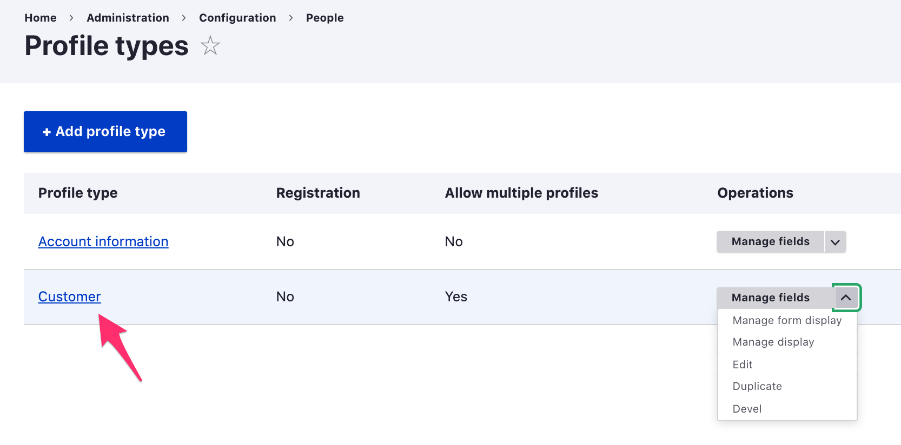
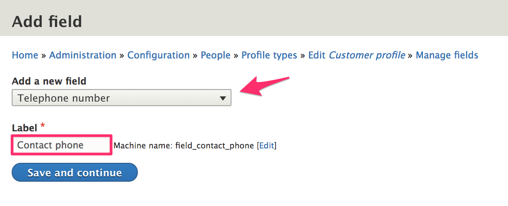

This section describes how you can use *Profiles* to capture and store information about your customers. In a default Drupal Commerce installation, the *Customer* profile type is provided for you. You can customize this *Customer* profile type to suit your needs and/or create additional profile types.

You can access the administrative page for the *Customer* profile type and any others you create at `/admin/config/people/profiles`.

### Customer profile fields
By default, profiles do not have any visible/editable fields; however, the *Customer* profile type includes an *Address* field. See the [Addresses documentation](../../02.addresses) section for information about *Address* fields. Each *Customer* profile has a single address. You can change the *Label* for the address field, as it's shown to customers, on the *Address settings* administrative page, located at `/admin/config/people/profiles/manage/customer/fields/profile.customer.address`.

You can add custom fields to a profile by navigating to its *Manage fields* administrative page. For *Customer* profiles, this page is located at `/admin/config/people/profiles/manage/customer/fields`. As an example, let's add a *Contact phone* field to our *Customer* profile type.

#### Customization example: *contact phone* field
##### Add the *contact phone* field
1. If the Drupal core [Telephone module] is not already installed, navigate to the *Extend* administrative page and install it: `/admin/modules`.
2. Navigate to the *Manage fields* administrative page for the *Customer* profile type and click the *Add field* button.
3. Select *Telephone number* as the field type.
4. Enter *Contact phone* for the field label.
5. Click the *Save and continue* button.

##### Configure the *contact phone* field
1. On the *Field settings* page, we'll leave the *Allowed number of values* set to 1.
2. Click the *Save field settings* button.
3. On the *settings* administrative page for *Contact phone*, select the [*This is a private field*](../03.profile-management#the-private-field-setting) setting.
4. Click the *Save settings* button.

Next, you can use the *Manage form display* and *Manage display* administration pages for the profile to customize how the new field appears on data entry forms and in a customer's *Address book*.

#### Adding fields to the customer profile vs. creating new profile types
The *customer* profile should contain all the billing information needed to process an order. If you have physical products and use the *Commerce shipping* module, then *customer* profiles will also be used for the shipping information associated with orders. For simpler commerce sites, especially those that are B2C, the *address* field may be all you need for the *customer* profile. For additional information, you could create a separate profile type to manage information about your customer like name and phone number. With this architecture, your customers would only enter need to enter their contact information once, for that separate profile type. In contrast, if you added the contact name and phone number fields to the *customer* profile, your customers would need to repeatedly enter that information for every billing and shipping address added.

For other commerce sites, your customers may actually be purchasing agents who order on behalf of a number of end users. In that case, you might need a set of additional fields associated with *each* billing and shipping address, such as contact email, contact name, contact phone, a note field, reference to a customer organization, reference to an assigned sales representative, etc. So, you would add each of these fields to your *customer* profile type. Your customers would have the flexiblity to enter completely different sets of data for each of their *customer* profiles. Ultimately, you'll need to decide what information needs to be captured on a per-order basis vs. what customer information you need apart from that billing- and shipping-specific data.

### Create a profile type
To create a new profile type:
1. Navigate to the *Profile types* administrative page at `/admin/config/people/profiles`.
2. Click the *Add profile type* button.
3. Enter the name of the profile type for the *Label*. You can use the default settings for all other options, for now.
4. Click the *Save* button.

#### Profile type configuration options
##### Label
This is the name of the profile type. Change the label to change how it's displayed to customers.

##### Description
The description field is only used for administrative purposes. It is displayed in the *Profile types* listing at `/admin/config/people/profiles`. If your store will have many different profile types, entering a description for each can be helpful for profile management.

##### Include in user registration form
By default, the *Customer* profile type is included in the user registration form. If this option is enabled for a profile type, then its data entry form will be embedded at the end of the new user registration form. In this example, *Contact phone* has been added to the *Customer profile* profile type, so it also appears on the registration form.

##### Allow multiple profiles
This option is enabled for the *Customer* profile type, to allow customers to create and save multiple addresses in their [*Address book*](../01.overview#address-book). If a user should only have a single set of data for a profile type, leave this option unselected. For example, if you create a *Contact information* profile type, you may want to have only one set of contact information per user.

##### Allowed roles
By default, there are no roles selected for the *Customer* profile type, which means that all users can have this profile type. If you allow customers to check out anonymously (i.e., "guest checkout"), then you need to allow *all* users to have *customer* profiles. Every order requires a *customer* profile for its *billing information* field. For other profile types, you may want to limit their usage to only certain, selected roles.

##### Create a new revision when a profile is modified
Profiles are revisionable. Select this option to force a profile entity to be saved as a new revision whenever the profile is updated. This setting is important for data integrity with respect to existing orders. Normally, you will want to enable this setting for the *Customer* profile type. In order to reduce unnecessary data replication, orders store only a reference to a *Customer* profile, not a copy of an entire profile entity. So if a customer places multiple orders, all with the same billing address, only one billing address needs to be stored. However, if the customer changes his address at some point, creating a new revision for the profile entity ensures that the data associated with previous orders does not change. The *new* revision of the profile will be used as the billing address for the current and future orders while leaving the previous version of the billing address in place for past orders.

---
In the next section, we'll look at profile management topics, including permissions and access control, managing profiles on behalf of customers, and options for importing and exporting profiles.

[Telephone module]: https://www.drupal.org/docs/8/core/modules/telephone/overview
