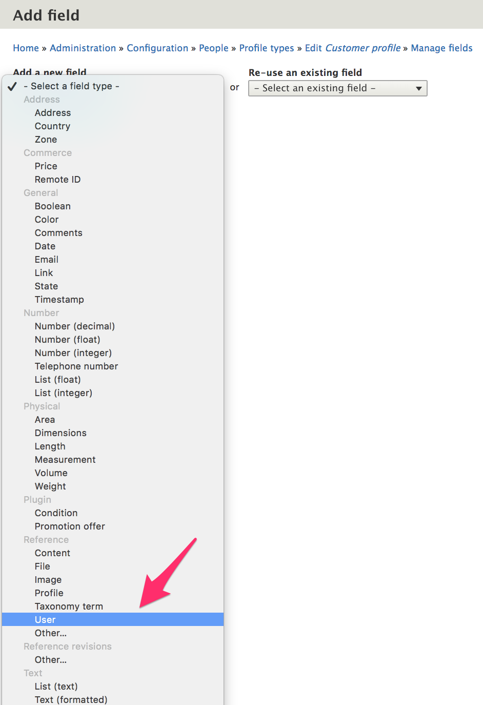
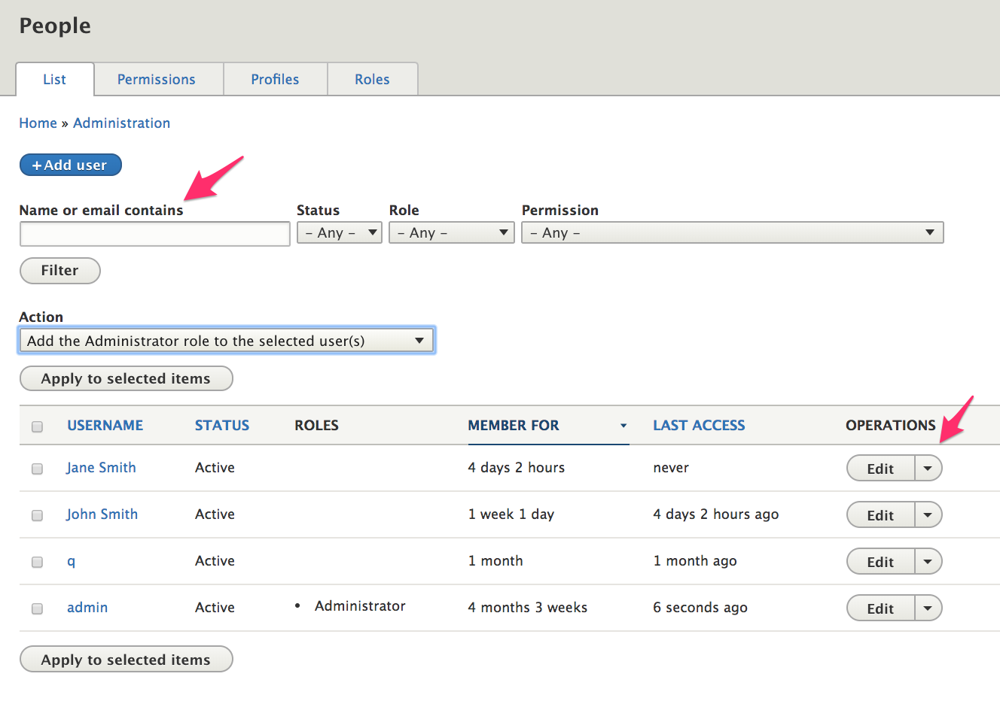
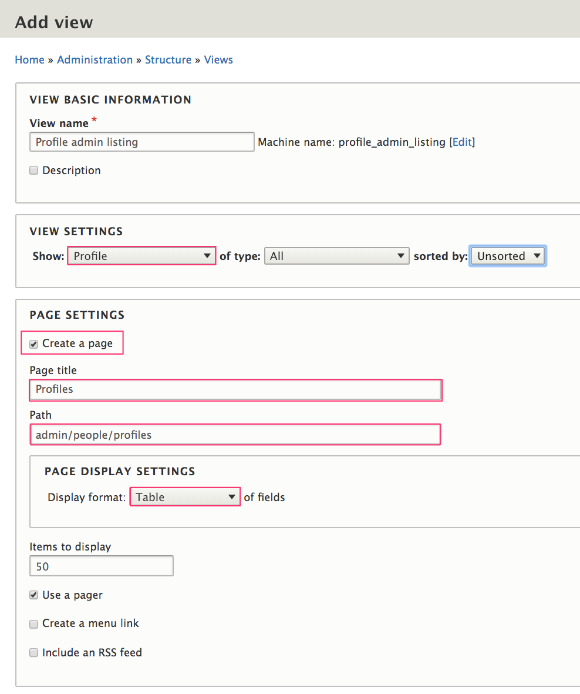
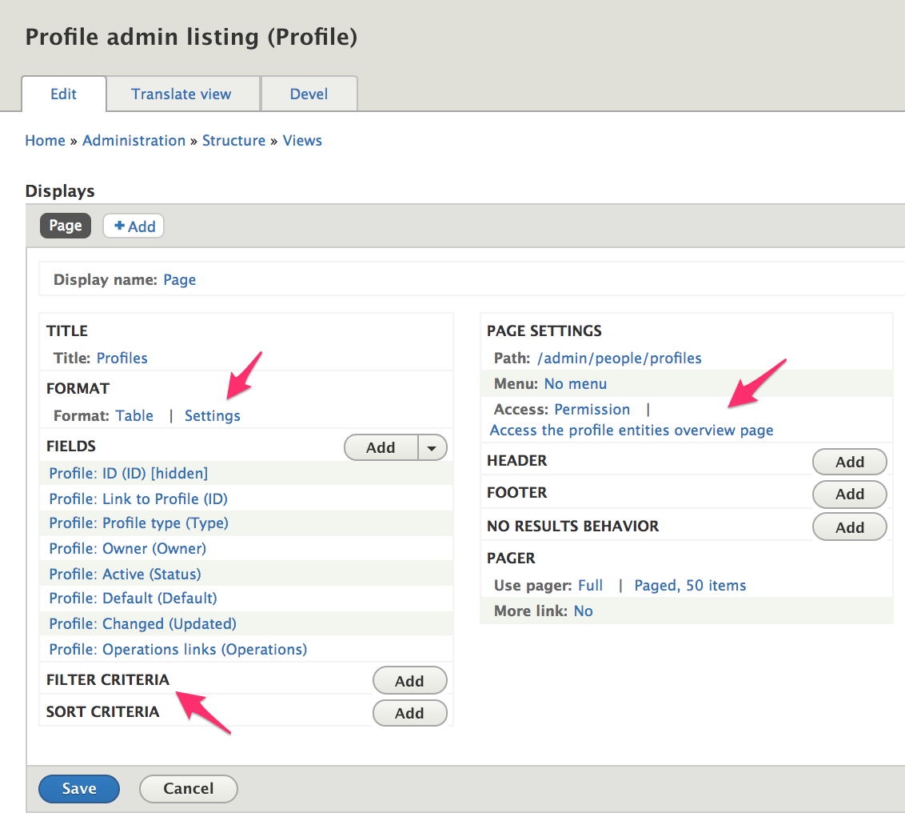

In this section, we'll look at profile management topics, including permissions and access control, managing profiles on behalf of customers, and options for importing and exporting profiles.

- [Profile access and permissions](#profile-access-and-permissions)
- [Manage profiles on behalf of customers](#manage-profiles-on-behalf-of-customers)
- [Importing profiles](#importing-profiles)
- [Exporting profiles](#exporting-profiles)

### Profile access and permissions
#### The *private field* setting
In the [Contact phone example in the Profile configuration documentation](../02.profile-configuration#customization-example-contact-phone-field), we specified that our custom *contact phone* field should be a *private field*. If a profile field is set as private, then only the owner of the profile and administrative users with the *Administer profile entities* (`administer profile`) permission will be able to access the field.

#### Profile permissions
The profile module provides some general administraive permissions as well as a set of permissions specific to each profile type. On the *Permissions* administrative page, at `/admin/people/permissions`, you'll find profile-related permissions in the *Field UI* and *Profile* sections.

##### *Field UI* permissions
- *Profile*: Administer display
- *Profile*: Administer fields
- *Profile*: Administer form display

These permissions should only be granted to users with administrative access to the site, typically users that are site builders or developers.

##### *Profile* permissions
- Access the profile entities overview page
- Administer profile types
- Administer profiles
- View any profiles
- View own profiles
- View own unpublished profiles
- And a set of permissions for each profile type:
 - Create profile entities
 - Delete any profile
 - Delete own profile entities
 - Update any profile
 - Update own profile entities
 - View any profile
 - View own profile


 Typically, you will want to allow your *Authenticated Users* (customers) to create profile entities and delete/update/view their own *Customer* profile entities. The rest of the permissions are more appropriate for administrative users.

### Field permissions module
If you need to limit access to certain *fields* for the *customer* profile or any other type of profile, you may be able to utilize display and form view modes to display/hide specific profile fields. If you need more sophisticated access control, the [Field permissions] contrib module can provide that functionality. For example, suppose each of your customers is assigned to a specific regional sales representative. You would like customers to be able to *view* their sales representatives, but only administrative users should be allowed to make sales representative assignments. Also, you want to include the *sales representative* field with your order data so that it can be tracked in sales reports. So, we want this field to be part of the *Customer* profile.

#### Customization example: *sales representative* field
1. Add and install the *Field permissions* module. (See the [Extending documentation](../../../02.install-update/06.extending) for instructions.)
2. Add a *Sales representative* field to your *customer* profile type using the same approach we used above for the [*contact phone* field](#add-the-contact-phone-field).
3. Select `Reference > User` for the field type. We could create a new [Taxonomy] for our *sales representative* information, but for this example, let's just assume that we'll create a [User account] for each of our sales representatives.



4. On the *Field settings* administrative page, the default settings are fine.
5. On the *settings* administrative page for the *Sales representative* field, enable *Custom permissions*.
6. For the *Authenticated user* role, enable only the *View anyone's value for field field_sales_representative* permission.


Now, customers will be able to view their sales representatives but not select their own.

### Manage profiles on behalf of customers
When you view the *Profiles* listing page at `/admin/people/profiles`, you'll see operations links that allow you to *Edit* and *Delete* profiles, but there's no way to add new profiles or efficiently search for existing profiles. Using out-of-the-box functionality, the best way to manage customer profiles is to access them via the main *People* listing page at `/admin/people`. Here, you can search by a variety of criteria, including name or email.



Once a customer account has been located, you can access his or her profiles from the *Edit* administrative page. You'll see a tab at the top of the page for each of your profile types. Here we see tabs for three profile types: *Contact information*, *Address book* (for *Customer* profiles), and *My custom profile type*. You can manage profiles on behalf of customers via these tabs.


#### Customize the labels for customer profile tabs
The label for the *Customer* profile tab is *Address book*. It has been customized by the Drupal Commerce *Order* module. You can customize labels for any profile type by implementing `hook_local_tasks_alter()` in a custom module, like this:

```php
function mymodule_order_local_tasks_alter(&$definitions) {
  $id = 'entity.profile.user_profile_form:profile.type.my_profile_type';
  if (isset($definitions[$id])) {
    $definitions[$id]['title'] = t('My custom label');
  }
}
```

#### Use Views to customize the *Profiles* listing page
If your administrative users will frequently manage profiles on behalf of customers, you may want to use Drupal Views to customize the Profiles listing page, located at `/admin/people/profiles`. If you are unfamiliar with using Views in Drupal, you can read about [Creating Listings with Views], in the Drupal 8 User Guide.

##### Example: View of profiles
To start, we'll create a View with a page that has the same title and path as the existing *Profiles* administrative listing page:



To configure, we'll add fields and for the *Page Settings*, and we'll set the *Access* to `Permission: Access the profile entities overview page`. Additionally, we'd want to set *Sortable* table fields and add exposed *Filters* to help administrative users search the list more easily.



##### Bulk update options
To allow administrative users to perform bulk operations on profiles, add the *Bulk update* field. The *Profile* module provides three bulk update options:
* Delete profile
* Publish profile
* Unpublish profile

If you are interested in creating additional [Action plugins] with custom code, the [Create an action for custom mass updates with Drupal 8], article is a good introduction to the topic.

### Importing profiles
For site builders, the [Commerce Feeds module] is a solution for importing profiles; unfortunately, it has not yet been fully ported into Drupal 8. If you are comfortable writing custom code for importing profiles, the [Commerce Migrate module] is a good place to start. There is a version for Drupal 8, [documentation], and an explanation of the differences between using Feeds vs. using Migrate for importing profiles and other commerce data.

### Exporting profiles
You can use the [Views data export module] to provide product export functionality. If you are unfamiliar with using Views in Drupal, start by reading about [Creating Listings with Views], in the Drupal 8 User Guide. Also, the [Importing and exporting documentation for Products](../../../03.products/03.product-management/04.importing-exporting#exporting-products) includes an example of using Views data export for exporting products. The same approach can be used for exporting profiles.

---

[Field permissions]: https://www.drupal.org/project/field_permissions
[Taxonomy]: https://www.drupal.org/docs/user_guide/en/structure-taxonomy.html
[User account]: https://www.drupal.org/docs/user_guide/en/user-concept.html
[Creating Listings with Views]: https://www.drupal.org/docs/user_guide/en/views-chapter.html
[Action plugins]: https://api.drupal.org/api/drupal/core!lib!Drupal!Core!Action!ActionInterface.php/interface/ActionInterface/8.5.x
[Create an action for custom mass updates with Drupal 8]: https://www.flocondetoile.fr/blog/create-action-custom-mass-updates-drupal-8
[Commerce Feeds module]: https://www.drupal.org/project/commerce_feeds
[Commerce Migrate module]: https://www.drupal.org/project/commerce_migrate
[documentation]: https://www.drupal.org/docs/8/modules/commerce-migrate
[Views data export module]: https://www.drupal.org/project/views_data_export

