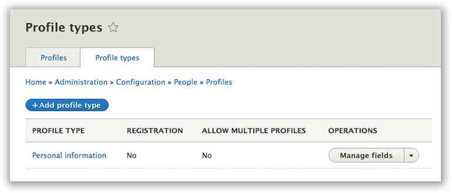

See Also: [Module on Drupal.org] | [Drupal 8 Issue]

Provides the profile entity type used to collect customer information.
In Commerce 1.x, we called these entities “Customer Profiles” and for
Commerce 2.x we have moved to where the community has extended user
profiles to include fieldable entity bundles. Customer profiles in
Commerce 2.x will be entities and orders will link to revisions,
avoiding the duplication we had in Commerce 1.x.



The Profile module provides a fieldable entity, that allows
administrators to define different sets of fields for user profiles,
which are then displayed in the My Account section. This permits users
of a site to share more information about themselves, and can help
community-based sites organize users around specific information.

You can pull the latest from the repository on [Drupal.org].

> one big long draft to be organized later

some of this may end up in the Overview doc


[Module on Drupal.org]: https://www.drupal.org/project/profile
[Drupal 8 Issue]: https://www.drupal.org/node/2598342
[Drupal.org]: https://www.drupal.org/project/profile


### Profile overview

Each customer can also have multiple stored addresses, which are called "profiles" in Drupal Commerce. the "address book" Customer profiles contain collections of data required to process orders and payments. Each profile has a single address and can optionally include other information like phone number or contact name.

"default" profile is per user, per bundle

- where does profile appear within checkout process, show "Billing information" pane image for checkout. Address plus additional field.

- usage for payments
- profiles vs user accounts: profile includes anything needed for billing/shipping business logic, revisionable, multiple variations per customer. User information is the same for all profiles, things like age, gender, etc. Doesn't change on a per-order or per-profile basis.

- profile is not translatable

### Profile configuration (administration?)
Customer profile type configuration:
`/admin/config/people/profiles/manage/customer`

Change the label to change how it's displayed to customers.
Include in user registration form.
Show screenshot of registration form

example: add phone field, add administrative note field

Use the *Allow multiple profiles* setting to allow customers to maintain an *address book* of multiple profiles/addresses.

Allowed roles.
Create a new revision when a profile is modified - for data integrity with respect to existing orders. Normally, you will want to enable this setting.

NO: skip this here: Billing Profile custom widget uses Profile select form element

Permissions: own/any, view/update permissions

### Profile management
- Add/edit profiles on behalf of customers
- View of profiles: step through example
- Importing/exporting profiles

### Code recipes
- CRUD operations, like products
- storage methods: loadby...
- ProfileLabelSubscriber - set to address line 1 by commerce_order, override to something else?
- theming?

```php
getStorage('profile')->load($profile_id);
getStorage('profile')->loadByUser($account, 'customer', TRUE);
loadMultipleByUser()
loadDefaultByUser()

```