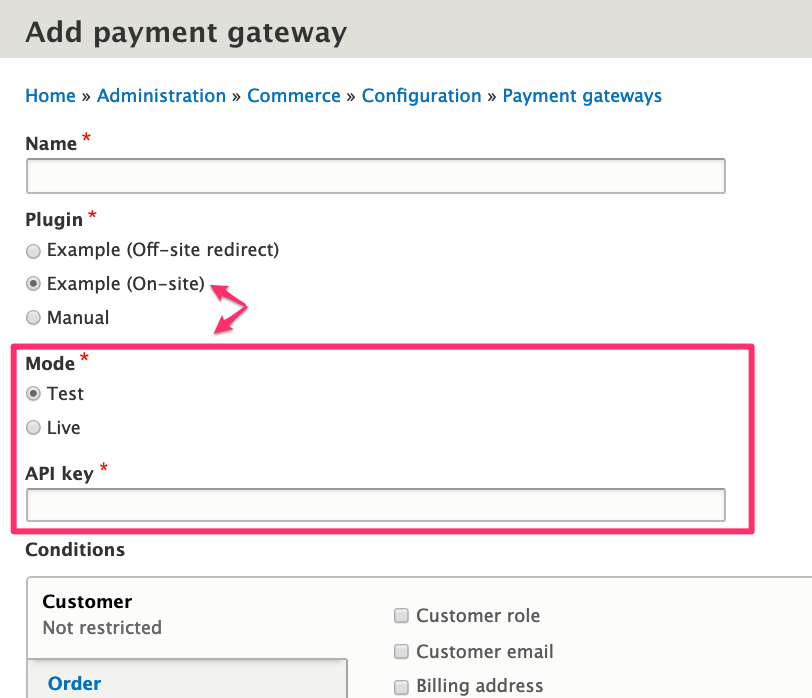
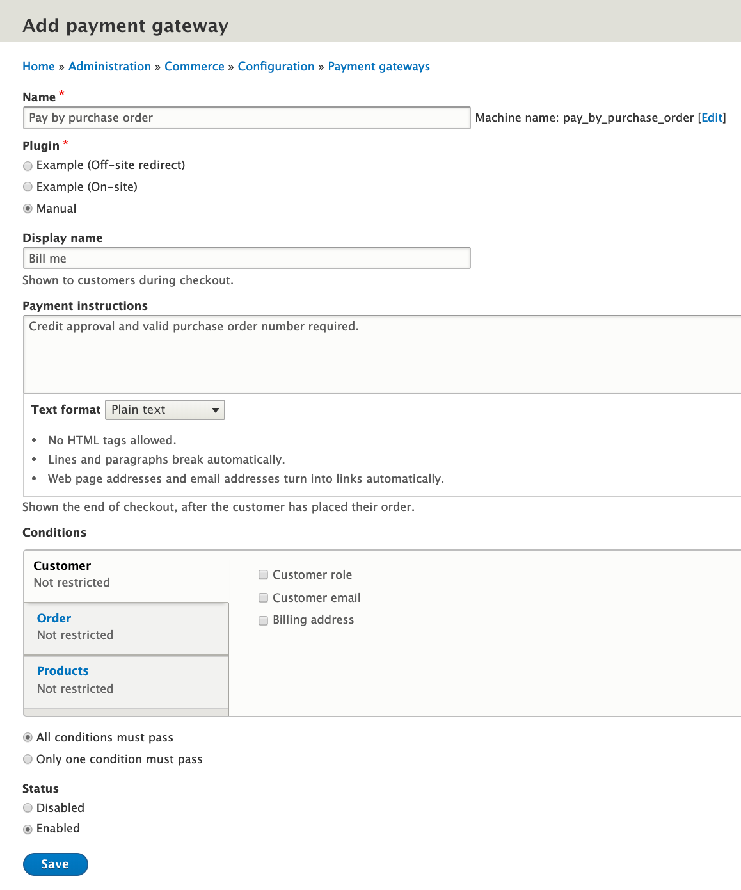

To accept payments on your Drupal Commerce site, start by enabling the *Commerce Payment* module, if you haven't already done so. Once it's been enabled, you can add and configure a payment gateway 

### Adding a payment gateway
You should see *Payment* as an option under the Commerce *Configuration* menu. Use that menu to navigate to the *Payment gateways* configuration page at `/admin/commerce/config/payment-gateways`.

Click the *Add payment gateway* button to create a payment gateway. By default, only one *Plugin* option will be available: *Manual*. If you want to experiment with other payment gateway options, you can enable the *Commerce Payment Example* module (which is also included with Drupal Commerce module). Doing so will give you two additional *Plugin* options. Changing the selected option will affect the configuration options available. For example, for the *Example (On-site)* plugin, the configuration options are *Mode* and (API key).

If you would like to configure your site to use an actual gateway for a real Payment Provider, see the [Installing and Configure a Payment Gateway](../install-configure-gateways) documentation.

### Configuring your payment gateway
Enter a *Name* and *Machine name* for your payment gateway. The name you enter will only be used internally, for identification by administrative users. The machine name will be automatically set based on the name you enter, but you can change it now if you want. Once the payment gateway has been created, you won't be able to change its machine name.

As described above, you will be presented with a list of *Plugin* options based on the payment gateway modules that have been installed on your site. Once the payment gateway has been created, you won't be able to change its plugin. See the documentation for the selected payment gateway plugin for information about its specific configuration. Here, we will select and configure the *Manual* plugin option provided by Drupal Commerce.

The *Display name* will be displayed to customers on the *Payment information* checkout pane. If *Payment instructions* are entered, that text will appear after the customer has completed the checkout process.

#### Conditions
The Conditions section of the configuration page allows you to specify the rules used to determine whether the payment gateway should be an available option for the customer. For more information about conditions, including documentation on how to customize existing conditions or create new ones, see the [Conditions](../../03.core/01.conditions) documentation.

Finally, you can also specify whether a payment gateway is enabled. Disabled payment gateways are not available to any customers, regardless of conditions, during checkout. Here is a full example of configuration for a *Manual* payment gateway:

After adding a payment gateway, you should see it listed on the Payment gateways page, at `/admin/commerce/config/payment-gateways`.

---
In the next section, we'll look at configuration for an actual payment gateway module, using the Commerce PayPal module as an example.
