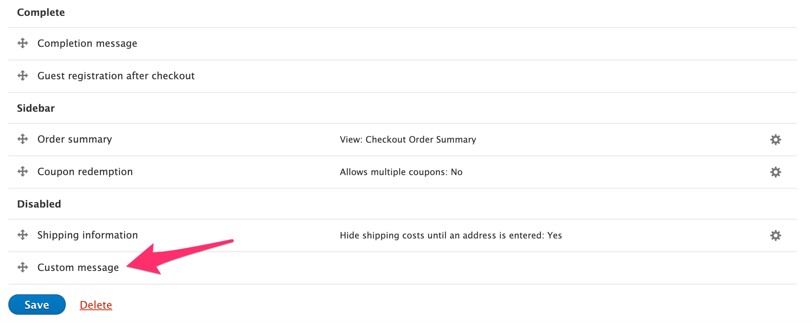
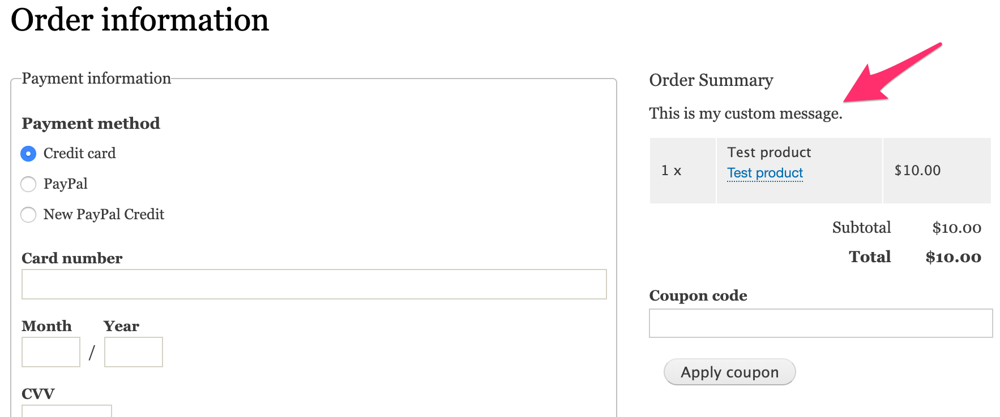
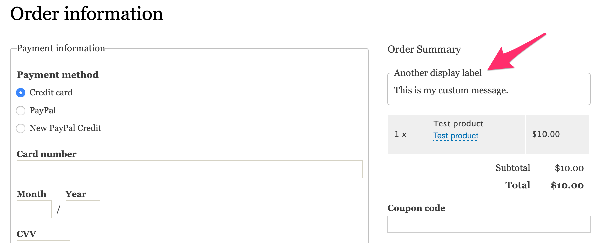

We will learn how to create a custom checkout pane.

We are going to add a custom completion message. It will appear along with the
default completion message.

Lets create a module that will do this.

If you are using [Drupal Console](https://drupalconsole.com/), then you can
execute this command from docroot:

```bash
drupal generate:module  \
  --module="My checkout pane" \
  --machine-name="my_checkout_pane" \
  --module-path="/modules/custom" \
  --description="My checkout pane" \
  --core="8.x" \
  --package="Custom" \
  --composer
```

Now create the plugin using this command:

```bash
drupal generate:plugin:skeleton  \
  --module="my_checkout_pane" \
  --plugin-id="commerce_checkout_pane" \
  --class="CustomCompletionMessage"
```

A new file ``CustomCompletionMessage.php`` will be created inside
``src/Plugin/Commerce/CheckoutPane``.

Make sure that file looks like this:

```php
<?php

namespace Drupal\my_checkout_pane\Plugin\Commerce\CheckoutPane;

use Drupal\commerce_checkout\Plugin\Commerce\CheckoutPane\CheckoutPaneInterface;
use Drupal\commerce_checkout\Plugin\Commerce\CheckoutPane\CheckoutPaneBase;
use Drupal\Core\Form\FormStateInterface;

/**
 * @CommerceCheckoutPane(
 *  id = "custom_completion_message",
 *  label = @Translation("Custom completion message"),
 *  admin_label = @Translation("Custom completion message"),
 * )
 */
class CustomCompletionMessage extends CheckoutPaneBase implements CheckoutPaneInterface {

  /**
   * {@inheritdoc}
   */
  public function buildPaneForm(array $pane_form, FormStateInterface $form_state, array &$complete_form) {
    $pane_form['message'] = [
      '#markup' => $this->t('This is a custom completion message.'),
    ];
    return $pane_form;
  }

}
```

Enable the module ``my_checkout_pane``.

```bash
drupal module:install my_checkout_pane
```

Now go ahead and place the pane.

Go to ``/admin/commerce/config/checkout-flows/manage/default``.

You will see the *Custom completion message* pane.





Now when you complete checkout, you will see the custom completion message like
this:


