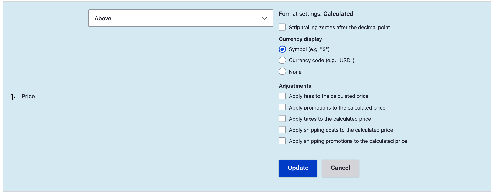

The Commerce Price module provides three field formatters and a custom Twig filter that can be used to display Price fields.

* [Plain price formatter](#the-plain-price-formatter)
* [Default price formatter](#the-default-price-formatter)
* [Calculated price formatter](#the-calculated-price-formatter)
* [Rendering prices in Twig](#rendering-prices-in-twig)

## Field formatters


### The *Plain* price formatter
The *Plain* price formatter displays the price using the `commerce_price_plain` theme hook. It does not use locale-specific patterns for formatting prices. Instead, it simply provides the Price *number* string and *currency* `Drupal\commerce_price\Entity\Currency` entity values for use in the template. The default `commerce_price_plain.html.twig` template formats the Price as a number with 2 decimal places followed by the 3-character currency code:

```
{{ number|number_format(2, '.', ',') }} {{ currency.currencyCode }}
```

It produces output that looks like this: `10.25 USD`.

This formatter can be useful for exported data (CSV). It can also be useful if you want to display Prices with a non-standard number of decimal places. For example, if you sell products in bulk in large quantities with small unit prices, you might need more than 2 decimal places.

Example: suppose you sell 12,000,000 units of SKU LWS00633 for a total price of $27,600.00, and you need to display the unit price as `0.0023`. To do this, you can override the default *Plain* price formatter template with a custom one:

```
{{ number|number_format(4, '.', ',') }}
```

### The *Default* price formatter
The *Default* price formatter uses the [Currency formatter service](../formatting-prices) to render a given Price value object based on its currency definition.  It offers two configuration options:

* Strip trailing zeroes after the decimal point.
* Currency display.
  - Symbol (e.g. "$")
  - Currency code (e.g. "USD")
  - None

### The *Calculated* price formatter
Like the *Default* price formatter, the *Calculated* price formatter also displays a Price formatted for its currency and offers the same *Strip trailing zeroes* and *Currency display* configuration options. Additionally, it uses [Price resolving](../price-resolvers) and can optionally apply other [Adjustments](../adjustments) (like promotions or taxes) to the resolved price. The *Calculated* price formatter can only be used for Price fields on entities that implement the [`PurchasableEntityInterface`](../../../03.products/02.product-architecture/10.code-recipes), such as Product variations.

Drupal Commerce actually provides two different implementations for this Price field formatter. A basic implementation is provided by the Commerce Price module. If the Commerce Order module is installed, then that basic implementation is replaced by one provided by Order module that uses the *Price Calculator* service to calculate the price a purchasable entity would have if it was in an order.

#### Calculated price formatter - Price module version
This formatter uses the `ChainPriceResolver` service to resolve the value of the price dynamically. It uses a quantity of 1, the current user, and the current store as the context for the price resolver. See the [Price resolvers](../price-resolvers) documentation to learn how Price resolvers calculate price values. Once the value is calculated, the formatter uses the [Currency formatter service](../formatting-prices) to render the Price based on its currency definition. 

#### Calculated price formatter - Order module version
The Order module version Price formatter provides all the functionality of the Price module version plus configuration options for applying adjustments. The field formatter can be configured to include any of the adjustment types defined for the site. If no adjustments are selected, the Order module version of the Calcualated price formatter behaves identically to Price module version.



The Calculated price formatter uses the `PriceCalculator` service provided by the Order module to calculate the value of the Price that's displayed. If any adjustment types are selected, an Order will be created (but not saved) that has a single Order item. The Order item has a quantity of 1 and the resolved price for its Unit price. Then all Order processors for the selected adjustment types *process* the Order, adding [Adjustments](../adjustments) when applicable. The final *adjusted total price* for the Order item is returned to the Calculated price formatter, where it is rendered based on its currency definition.

## Rendering prices in Twig.

The Commerce Price module also provides the `commerce_price_format` Twig filter which renders a given Price value object based on its currency definition. Here is an example of using the Twig filter by utilizing the `inline_template` element type.

```php
$element['price'] = [
  '#type' => 'inline_template',
  '#template' => '{{ price|commerce_price_format }}',
  '#context' => [
    'price' => new \Drupal\commerce_price\Price('10.25', 'USD'),
  ],
];
```

This would render as $10.25.

This Twig filter can be used on both [Price value objects](../prices) and arrays with `number` and `currency_code` keys. It uses the [Currency formatter service](../formatting-prices) to render the Price based on its currency definition.

## Rendering prices without Twig.

The [Currency formatter service](../formatting-prices) can also be used independently to get a localized formatted price string for any [Price object](../prices). Here is an example for displaying, "The price is $5.95":

```php
$currency_formatter = \Drupal::service('commerce_price.currency_formatter');
/** @var \Drupal\commerce_price\Price $price */
$price = new Price('5.95', 'USD');
$formatted_price = $currency_formatter->format($price->getNumber(), $price->getCurrencyCode());

$price_output = t('The price is @amount', [
	'@amount' => $formatted_price,
]);
```

For advanced customization, you can set an array of additional options for the `format()` method. For example, the `minimum_fraction_digits` and `maximum_fraction_digits` options can be used to override the currency's standard number of fraction digits. For the complete list of options, see [CommerceGuys\Intl\Formatter\CurrencyFormatterInterface].

In this example, we modify the previous example to display, "The price is 5.9500", with 4 fraction digits and no currency symbol:

```php
$formatted_price = $currency_formatter->format($price->getNumber(), $price->getCurrencyCode(), [
  'minimum_fraction_digits' => 4,
  'maximum_fraction_digits' => 4,
  'currency_display' => 'none',
]);
```

[CommerceGuys\Intl\Formatter\CurrencyFormatterInterface]: https://github.com/commerceguys/intl/blob/master/src/Formatter/CurrencyFormatterInterface.php
