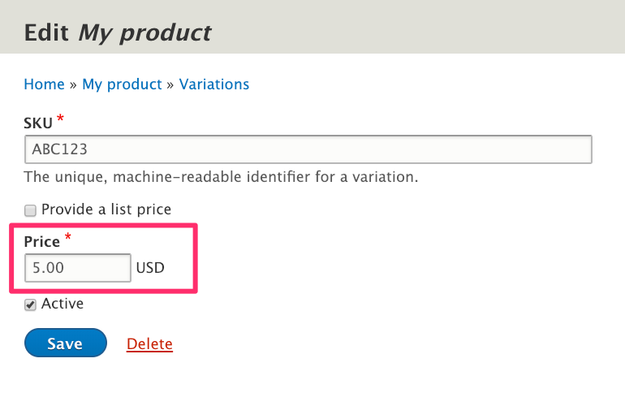

Whenever a price is displayed on a product page or set for an item added to a shopping cart, that price is calculated dynamically using one or more *price resolvers*. If your Drupal Commerce site only requires a single price per product variation (SKU), then the default price resolver is sufficient. The default price resolver simply returns the price that has been set for the product variation (or other purchasable entity).



If your pricing requirements are more complex, then you will likely need a custom price resolver. You may be able to use a contrib module that provides a price resolver. For example, the [Commerce Pricelist] module includes a `PriceListPriceResolver` price resolver that looks up the price for a purchasable entity from a list of separately stored prices. Or you may need to write your own in a custom module. For an overview of the resolver concept as well as a variety of code examples, see the [Links and resources](#links-and-resources) section at the end of this document. Here, we'll step through an example of creating a price resolver that provides per-store pricing for a multi-store site.

To start, let's suppose we have a table in our database named `custom_store_prices` that stores a price value for every store/sku combination available on our site. (See the Drupal [Schema API] documentation for an overview on creating custom database tables.) We'll creating a custom price resolver by implementing the `PriceResolverInterface`. Here is the basic structure:

```php
<?php

namespace Drupal\my_module\Resolver;

use Drupal\commerce\Context;
use Drupal\commerce\PurchasableEntityInterface;
use Drupal\commerce_price\Resolver\PriceResolverInterface;
use Drupal\commerce_product\Entity\ProductVariationInterface;

/**
 * Returns the price fetched from the custom_store_prices table.
 */
class PriceResolver implements PriceResolverInterface {

  /**
   * {@inheritdoc}
   */
  public function resolve(PurchasableEntityInterface $entity, $quantity, Context $context) {
    if (!$entity instanceof ProductVariationInterface) {
      return NULL;
    }
  }

}
```

The `resolve()` method is defined by the `PriceResolverInterface` and should resolve a price for the given purchasable entity. It returns `\Drupal\commerce_price\Price` or `null`.

In our example code, we check whether the purchasable entity is an instance of `ProductVariationInterface` so that we can safely use the product variation's `getSku()` method to look up the price in our custom data table.

To get the store ID for our price lookup, we'll use the `$context` value. `Context` is a value object used by price resolvers and availability checkers. It contains known global information:

| Property | Description |
| ---------|------------ |
| customer | The customer assigned to the cart/order *or* the current user if resolving a price outside the context of an order. |
| store | The store assigned to the cart/order *or* the current store if resolving a price outside the context of an order. |
| time | Can be set to a unix timestamp but defaults to the current time. |
| data | An array of data. For price resolvers, use `$context->getData('field_name', 'price')` to get the name of the field for which the price is being resolved (e.g "list_price", "price"). |

To look up a value in our custom `custom_store_prices` table, we'll inject the database connection service into our price resolver, like this:

```php
  /**
   * The database connection.
   *
   * @var \Drupal\Core\Database\Connection
   */
  protected $connection;

  /**
   * Constructs a PriceResolver object.
   *
   * @param \Drupal\Core\Database\Connection $connection
   *   The database connection.
   */
  public function __construct(Connection $connection) {
    $this->connection = $connection;
  }
```

Don't forget to include the `use` statement for the database connection. We'll also need the `Price` class:

```php
use Drupal\commerce_price\Price;
use Drupal\Core\Database\Connection;
```

Now we can implement the `resolve()` method to look up the product variation price in the custom price table:

```php
  /**
   * {@inheritdoc}
   */
  public function resolve(PurchasableEntityInterface $entity, $quantity, Context $context) {
    if (!$entity instanceof ProductVariationInterface) {
      return NULL;
    }

    $select = $this->connection->select('custom_store_prices', 'csp')
      ->fields('csp', ['price'])
      ->condition('store_id', $context->getStore()->id())
      ->condition('sku', $entity->getSku());
    $result = $select->execute()->fetchAssoc();

    if (isset($result['price'])) {
    	return new Price((string) $result['price'], $context->getStore()->getDefaultCurrencyCode());
    }
    return NULL;
  }
```

With our price resolver class complete, we're ready to add this service to our custom module's [service file].

```php
  my_module.price_resolver:
    class: Drupal\my_module\Resolver\PriceResolver
    arguments: ['@database']
    tags:
      - { name: commerce_price.price_resolver, priority: 200 }
```

We've assigned a priority of 200 to our custom price resolver so that it will execute before the default price resolver with its priority of -100. If our custom resolver fails to return a price for the purchasable entity (and no other custom price resolvers exist and produce a result), then the default resolver will return whatever price is set for the purchasable entity. The default price resolver is implemented by the `Drupal\commerce_price\Resolver\DefaultPriceResolver` class.

### Links and resources:
* [Understanding resolvers documentation](../../core/understanding-resolvers) describes several types of resolvers used within Drupal Commerce and provides an overview of how their code is structured.
* [Commerce Pricelist] is a contributed module that supports creating price lists for different dates, stores, individual roles or users.
* [Modifying product prices in Drupal Commerce 2 for Drupal 8](https://www.rapiddg.com/blog/modifying-product-prices-drupal-commerce-2-drupal-8) has several examples of custom price resolvers.
* [Drupal Commerce 2.x and sale price](https://dev.studiopresent.com/blog/back-end/drupal-commerce-2-and-sale-price) provides example code for creating a "sale price" price resolver.

[Commerce Pricelist]:https://www.drupal.org/project/commerce_pricelist
[Schema API]:https://api.drupal.org/api/drupal/core%21lib%21Drupal%21Core%21Database%21database.api.php/group/schemaapi/8.2.x
[service file]:https://www.drupal.org/docs/8/api/services-and-dependency-injection/structure-of-a-service-file
