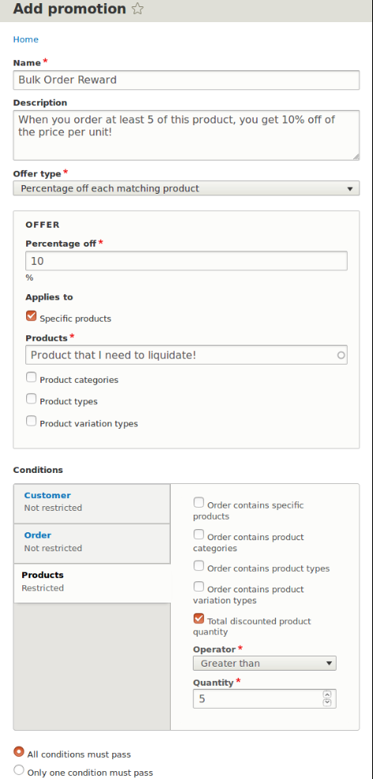

Commerce conditions are used in when creating a Promotion or a Payment Gateway for your store. 

Promotion Example using class OrderItemQuantity:

User story:
  As a store manager I want to encourage bulk ordering by creating a promotion that applies to orders of at least 5 of the selected product. 
  
 
  
  
  Lets look how the code actually processes this condition. 
 
 /commerce/modules/promotion/src/Plugin/Commerce/Condition/OrderItemQuantity.php

```php
<?php
// namespace & use

/**
 * Provides the total discounted product quantity condition.
 *
 * Implemented as an order condition to be able to count products across
 * non-combined order items.
 *
 * @CommerceCondition(
 *   id = "order_item_quantity",
 *   label = @Translation("Total discounted product quantity"),
 *   category = @Translation("Products"),
 *   entity_type = "commerce_order",
 *   parent_entity_type = "commerce_promotion",
 *   weight = 10,
 * )
 */
class OrderItemQuantity extends ConditionBase implements ParentEntityAwareInterface {

  use ParentEntityAwareTrait;

  /**
   * {@inheritdoc}
   */
  public function defaultConfiguration() {
    return [
      'operator' => '>',
      'quantity' => 1,
    ] + parent::defaultConfiguration();
  }

  /**
   * {@inheritdoc}
   */
  public function buildConfigurationForm(array $form, FormStateInterface $form_state) {
    $form = parent::buildConfigurationForm($form, $form_state);

    $form['operator'] = [
      '#type' => 'select',
      '#title' => t('Operator'),
      '#options' => $this->getComparisonOperators(),
      '#default_value' => $this->configuration['operator'],
      '#required' => TRUE,
    ];
    $form['quantity'] = [
      '#type' => 'number',
      '#title' => t('Quantity'),
      '#default_value' => $this->configuration['quantity'],
      '#min' => 1,
      '#required' => TRUE,
    ];

    return $form;
  }

  /**
   * {@inheritdoc}
   */
  public function submitConfigurationForm(array &$form, FormStateInterface $form_state) {
    parent::submitConfigurationForm($form, $form_state);

    $values = $form_state->getValue($form['#parents']);
    $this->configuration['operator'] = $values['operator'];
    $this->configuration['quantity'] = $values['quantity'];
  }

  /**
   * {@inheritdoc}
   */
  public function evaluate(EntityInterface $entity) {
    $this->assertEntity($entity);
    /** @var \Drupal\commerce_order\Entity\OrderInterface $order */
    $order = $entity;
    /** @var \Drupal\commerce_promotion\Entity\PromotionInterface $promotion */
    $promotion = $this->parentEntity;
    $offer = $promotion->getOffer();

    $quantity = '0';
    foreach ($order->getItems() as $order_item) {
      // If the offer has conditions, skip order items that don't match.
      if ($offer instanceof OrderItemPromotionOfferInterface) {
        $conditions = $offer->getConditions();
        $condition_group = new ConditionGroup($conditions, 'OR');
        if (!$condition_group->evaluate($order_item)) {
          continue;
        }
      }
      $quantity = Calculator::add($quantity, $order_item->getQuantity());
    }

    switch ($this->configuration['operator']) {
      case '>=':
        return $quantity >= $this->configuration['quantity'];

      case '>':
        return $quantity > $this->configuration['quantity'];

      case '<=':
        return $quantity <= $this->configuration['quantity'];

      case '<':
        return $quantity < $this->configuration['quantity'];

      case '==':
        return $quantity == $this->configuration['quantity'];

      default:
        throw new \InvalidArgumentException("Invalid operator {$this->configuration['operator']}");
    }
  }

}
```

! We need help filling out this section! Feel free to follow the *edit this page* link and contribute.
