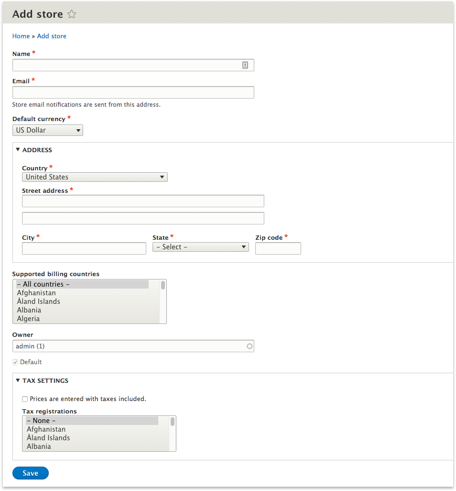

Stores are used for invoicing, tax types, and any other settings necessary for understanding orders. This has many applications, and it's important to understand what use cases are supported out of the box and how that impacts checkout and other order workflows.

## Before we begin

To create a store you will need to have at least one currency imported,
and then you can create a store. When Drupal Commerce is first installed, the Drupal site's default country's currency is imported. If your site was configured as United States the USD currency will be imported, if the default country was Germany then EUR would have been imported.

See [Adding a currency](../01.importing-currencies) to add a new currency, if needed.

## Create a store.

Next, we need to create a store. Every product requires one store.
Additional details will be shared about the power of
having stores baked into the core of Commerce, but for now, all you need
to do is define your store’s name, address, and select a few things
about taxes and billing.

Once you’ve got all those details filled out, click save and move on to
creating products! Woohoo!

## Use Cases

! This section should be moved to a subsection, possibly. Detailing how to use multiple stores, or setup a marketplace model.

We optimize for the two use cases:

1. One business that has one or more locations **or** 2. The marketplace model (where you have sellers)

For these use cases and possibly others, it is up to the developer to
fill in the gaps that are present in the order workflow. This is
different from Commerce 1.x in that we will support stores by default,
allowing for community contributions to extend the functionality instead
of trying to build store functionality from scratch.

#### One or more locations

This is the most common eCommerce situation where we have a single
person, company, or organization that is taking payments online.

#### Marketplace model

The marketplace model is where you have many sellers who are taking
payment for unique products.
